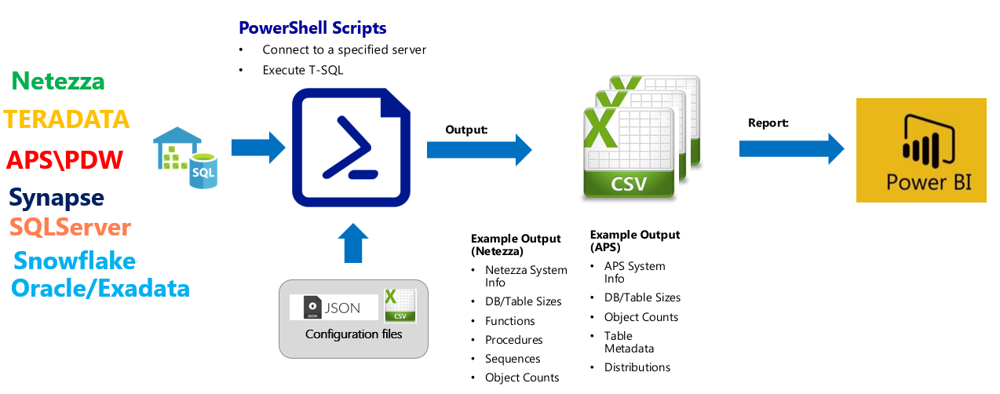
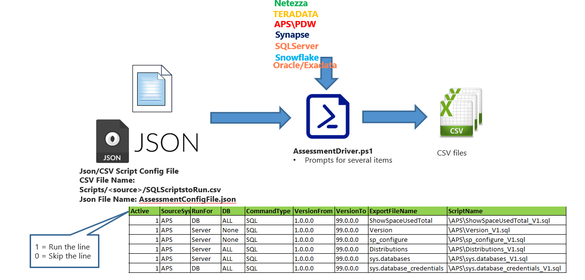
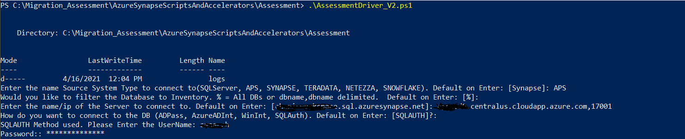

# **Assessment and Scoping Tool (PowerShell):** Assess the Source System and Summarize Information for Scoping a Migration Effort

[TOC]

Assessment tool is used to gather information on the Source System DBs to better enable an
accurate estimate for the migration.

## **Assessment Tool Dataflow**



## **Assessment Tool Summary**

| **Supported Source Systems**    | **Benefits**                  | **Tool details**  | **Capturing Information** |
| ------------------------------------------------------------ | ------------------------------------------------------------ |------------------------------------------------------------ |------------------------------------------------------------ |
|<ul><li>APS</li><li>SYNAPSE</li><li>Teradata</li><li>SQLServer</li><li>SNOWFLAKE</li><li>SNOWFLAKE</li>NETEZZA</ul> |<li>Source System inventory to migrate​</li><li>Scoping the migration effort with consolidated reports​</li><li>Generation of Power BI report​</li><li>Ability to add additional inventory queries​</li><li>Supports data gathering at different levels(ex: Server, DB level and table level)​</li><li>Supports different authentication types (ex: ADPass, AzureADInt, WinInt, SQLAuth)</li> |<li>Easy to configure and run​</li><li>Built on PowerBI​</li><li>Supports multiple iterations to run​</li><li>**Inputs:** ​</li><li>Source System details​</li><li>Ex: server,DB,port,username & password​</li><li>**Steps to execute:** ​</li><li>**Step 1** – Assessment driver execution​</li><li>**Step 2** -  PowerBI report generation​</li><li>Outputs:​</li><li>CSV files with the source system inventory details</li>|<li>DB Version​</li><li>Object Count​</li><li>Object Metadata(Size, partitions count, distribution type, distribution column, etc.)​</li><li>Size of the System​</li><li>Users & schema information</li> |


## **Assessment script details**

| **Script Name**    | **Description**                  | **Dependency files**  | 
| -------------------- | -------------------- | -------------------- |
|<ul>AssessmentDriver_V2.ps1</ul>|<ul>Main driver program to run the source assessment SQL scripts</ul>|<ul><li>AssessmentConfigFile.json</li><li>AssessmentDriverFile.json</li><li>Scripts/<sourcesystem>/SQLScriptsToRun.csv</li><li>RunSQLStatement.ps1</li></ul>  |
|<ul>AssessmentConfigFile.json</ul>|<ul>Current source system configuration details.These details can be provided during the execution as well</ul>||
|<ul>AssessmentDriverFile.json</ul>|<ul>Config file that holds the general configuration details and queries needed per source system to capture version,DB & Table lists</ul>|
|<ul>Scripts/<sourcesystem>/SQLScriptsToRun.csv</ul>|<ul>Holds the list of SQL scripts that needs to be executed on the source system</ul>|
|<ul>RunSQLStatement.ps1 | <ul>Wrapper script to execute the SQL statements </ul> | Scripts/<sourcesystem>/SQLScriptsToRun.csv |

## **Environment Setup**
Powelshell may expect you to setup the execution policies.
*[Please refer this URL for the execution policy details](https://docs.microsoft.com/en-us/powershell/module/microsoft.powershell.security/set-executionpolicy?view=powershell-7.1)*

**Example policy setup:** You can bypass the execution policy at the session level by running the below command on the powershell prompt
```
   Set-ExecutionPolicy -Scope Process -ExecutionPolicy Bypass

```

## **Configuration Files Preparation**

***1.Configuration/json file changes***

Edit this  **AssessmentConfigFile.json** only if:

- Databases needs to be filtered
- To create separate results folders for each run

| **Key**                      | **Purpose**                                                     | **Value   (Sample)**                                      |
| --------------------------| ------------------------------------------------------------ | ----------------------------------------------------- |
|PreAssessmentOutputPath    | To specify the output folder                       | Any valid folder name. **Ex:** Results                     |
|ServerName                 | To specify the source DB server details.This can be provided during execution as well| testapsserver.centralus.cloudapp.azure.com,17001|
|DSNName                    | Required field only for Teradata & Netezza. It is case sensitive.It requires DSN to be created locally on the local machine where the scripts are executed| **Ex:** TD |
|DBFilter                   | Required to filter the DBs to be assessed. Recommendation is to run it for all DBs(%) unless there is any specific restrictions for any DBs | **Ex:** testdb1,testdb2 or % - default |
|SourceSystem               | To specify the source system name from the supported sources.This can be provided during execution as well | **Ex:** APS |
|ConnectionType             | To specify the authenticatype to connect to the source DB. This can be provided during execution as well | **Ex:** SQLAuth |
|StoreOutputInSeperateFolders|To specify how to store the results for multiple iterations of the assessment.By enabling this key creates separate folder for each execution |  True or False(default)|

***2.SQL CSV file changes***

Edit this **scripts/<sourcesystem>/SQLScriptstoRun.csv** File based on the information desired to be collected. 

Note: This file only needs to be edited if:

- Need to not collect a specific results of a single query.
- Need to Limit the results to a single DB.
- Need to add a query to the result set.
- Need to update a query to run on a specific version of the source system.


| Parameter    | Purpose                                                      | Value   (Sample)                                      |
| ------------ | ------------------------------------------------------------ | ----------------------------------------------------- |
| Active       | 1 – Run line, 0 – Skip line                                  | 0 or 1                                                |
| SourceSystem | Source system to connect to and run the Query against.       | <ul><li>Netezza</li><li>APS</li><li>AZUREDW</li></ul> |
| RunFor       | <ul><li>DB = Run Query for each Database on the server</li><li>Server = Server level Query</li><li>Table = Run Query for each Table in each DB.</li></ul> | DB, Server, Table                                     |
| DB           | Limit the DB to a single DB                                  | Database name                                         |
| CommandType   | <ul>File name for the Command to run.</ul>          | SQL, DBCC, ScriptDB                                   |
| VersionFrom  | Each line is validated against the version of the DB.  As DB versions change, the Query may need to be changed for the given version or may not be valid on some version.  This the starting version that the line/query can be run on. | Depend on the source system                           |
| VersionTo    | This the Ending version that the line/query can be run on.   | Depend on the source system                           |
| ExportFileName | Name to use to save the results of the query to.  A Timestamp will be appended to the end of the field value.  “ShowSpaceUsedTotal_{TimeStamp}” | ShowSpaceUsedTotal                                                |
| ScriptName   | SQL statement to be run against the source system                |                                                       | \APS\ShowSpaceUsedTotal_V1.sql

## **How to Run the Assessment Program**

The program processing logic and information flow is illustrated in the diagram below: 



**Steps to execute the Assessment tool:**

- Clone the repository to the local folder (ex: C:\Migration_Assessment).[Refer this documentation for Git commands](https://github.com/git-guides/git-clone)

- Run the Assessment Tool by executing the below command on Powershell prompt:

```
PS C:\Migration_Assessment\SynapseScriptsAndAccelerators-main\Assessment> .\AssessmentDriver_V2.ps1
Mode                 LastWriteTime         Length Name
----                 -------------         ------ ----
d-----          4/9/2021   7:41 AM                logs
Enter the name Source System Type to connect to(SQLServer, APS, SYNAPSE, TERADATA, NETEZZA, SNOWFLAKE). Default on Enter: [teradata]: APS
Enter the name/ip of the Server to connect to. Default on Enter: [charisworkspace.sql.azuresynapse.net]: apspod0.centralus.cloudapp.azure.com,17001
How do you want to connect to the DB (ADPass, AzureADInt, WinInt, SQLAuth). Default on Enter: [SQLAUTH]?:
SQLAUTH Method used. Please Enter the UserName: amaarch
Password:: **************

```
***This will prompt for the following Information: Default values get picked up from AssessmentConfigFile.json. Once the details are provided then it updates the configuration file***

* **Source System Type:**  Provide the source database type from the supported systems.
* **name/ip of the Server:** Source Database server to connect

* **How do you want to connect to the DB (ADPass, AzureADInt, WinInt, SQLAuth)?** – When connecting to the source system, what method should be used to connect to the DB?

  * Default: SQLAuth
    * SQLAuth – Use a Source system (APS/SQLDW/Netezza/Teradata) username and password.  Teradata/Netezza – only method tool connects to these sources
    * ADPass – Use Azure AD to authenticate and supply the AD username and Password – AzureDW only
    * AzureADInt – Use Azure AD to authenticate and connect to the DB – AzureDW only
    * WinInt – Use Windows AD authentication to connect to the Source Server. – APS only

  - If ADPASS or SQLAUTH is used to connect to the source DB.
    - “**(ADPass/SQLAuth Method used. Please Enter the UserName.**” – User name with permission run the scripts“
    - "**Password**:” – Enter the password for the username entered above


**Sample Assessment Tool executions**

