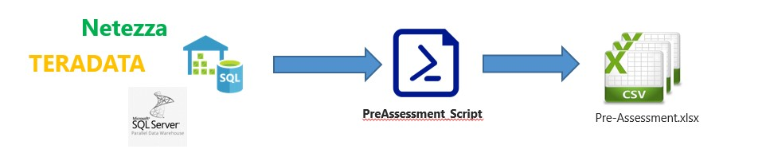
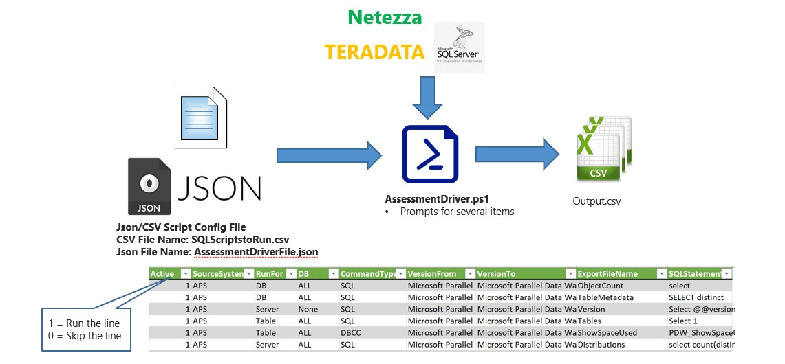
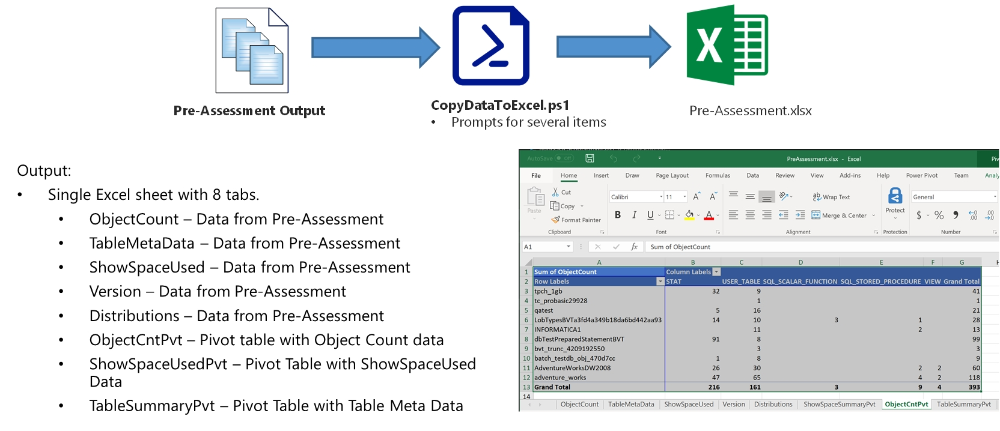

# **Assessment and Scoping Tool (PowerShell):** Assess the Source System and Summarize Information for Scoping a Migration Effort

[TOC]

## Assessment Tool Summary**

Assessment tool is used to gather information on the Source System DBs to better enable an
accurate estimate for the migration.




### Benefits:

- Inventory source system to migrate
- Scope Migration effort


### Features:

| **Multi-Platform Support**                                   | **Information  Captured**                                    |
| ------------------------------------------------------------ | ------------------------------------------------------------ |
| <ul><li>APS</li><li>Netezza</li><li>Teradata</li></ul>       | <ul><li>DB Version</li><li>Object Count</li><li>Object Metadata (Size, Partitions counts, Distribution type, Distribution Column)</li><li>Size of System</li></ul> |
| **Standard output format**                                   | **Configurable solution**                                    |
| <ul><li>CSV</li><li>Time Stamped File Names</li><li>Teradata</li></ul> | <ul><li>Ability to add addition Queries</li><li>Data Gathered by:</li><ul><li><li>Server Level</li><li>Database Level</li><li>Table Level</li></ul></ul> |

## **How to Run the Assessment Program**

The program processing logic and information flow is illustrated in the diagram below: 




Below are the steps to run the Assessment Tool: 

**Step 1:** Update the General_Config section of the AssessmentDriverFile.json.

- "PreAssessmentDriverFile":"C:\\\TEMP\\\SQLScriptstoRun.csv“
- "PreAssessmentScriptPath":"C:\\\Temp\\\Assessment\Scripts“
- "PreAssessmentOutputPath":"C:\\\Temp\\\Netezza\\\Pre-Assessment"
- "ServerName":"192.xxx.xxx.xxx",
- "SourceSystem":“APS“  --NETEZZA or APS or AZUREDW
- "DBFilter":"%" --% for All DBs or a comma delimited list "DBOne, DBTwo"

**Step 2:** 1.Update the Source System specific section of the AssessmentDriverFile.json. 

- APS
  - "Port":"17001“ – For APS = 17001, AzureDW = “” 
- Netezza
  - "Database":"SYSTEM“  
  - “Port":"5480",  
  - “nzBinaryFolder":"/nz/support-IBM_Netezza-7.2.1-151023-1043/bin",
  - "SchemaExportFolder":"~/schema"

**Step 3:** Run the Powershell Script(AssessmentDriver_V2.ps1).  This script will prompt for the following  Information: 

* “**How do you want to connect to the DB (ADPass, AzureADInt, WinInt, SQLAuth)?**” – When connecting to the source system, what method should be used to connect to the DB?

  * Default: SQLAuth
    * SQLAuth – Use a Source system (APS/SQLDW/Netezza/Teradata) username and password.  Teradata/Netezza – only method tool connects to these sources
    * ADPass – Use Azure AD to authenticate and supply the AD username and Password – AzureDW only
    * AzureADInt – Use Azure AD to authenticate and connect to the DB – AzureDW only
    * WinInt – Use Windows AD authentication to connect to the Source Server. – APS only

  - If ADPASS or SQLAUTH is used to connect to the source DB.
    - “**(ADPass/SQLAuth Method used. Please Enter the UserName.**” – User name with permission run the scripts“
    - "**Password**:” – Enter the password for the username entered above

## **Preparation Task 1: AssessmentFileDriver.json**

The AssessmentFileDriver.json file is divide into several sections. 

1.  General Configuration

   •  Generic Configuration values necessary for all source systems

2. APS Specific Configuration

   •  APS Configuration values such as default DB and connection port

3. Netezza Specific Configuration

   •  Netezza Configuration values such as connection port, default db and others info

4.  Version Query – Query needed by each source system to retrieve the version of the system

5.  DB Listing Query – Query needed by each source system to retrieve a listing of all DB’s on the system.

6.  Table Listing Query – Query needed by each source system to retrieve a listing of all Tables with in a DB on the system.

### General Configuration: 

The values in the General Configuration section will need to change based on the location of the config files and the source system being assessed.

- PreAssessmentDriverFile – Location and filename of the csv config file.
- PreAssessmentOutputPath – Location to store the output of the Assessment Tool.
- ServerName – Name or IP of the source system to assess.
- SourceSystem – NETEZZA, APS, TERADATA, AZUREDW
- QueryTimeout – Length of time before the query should timeout if results have not been returned.  
- ConnectionTimeout – Length of time to wait on a connection to the source system to be made before timing out.

### **APS\AzureDW Configuration: 

The values in the APS Configuration section that may need to change if connecting to APS or AzureDW.

- Database – Default DB for APS/AzureDW.  This should not be changed.
- Port – Port to use to connect to the APS/AzureDW.  
  - APS = 17001
  - AzureDW = “”

### Netezza Configuration: 

The values in the Netezza Configuration section that may need to change if connecting to APS or AzureDW.

- Database – Default DB for Netezza.  This should not be changed.
- Port – Port to use to connect to the Netezza.  
- nzBinaryFolder – Location where the nz_ddl command needs to be executed from.
- SchemaExportFolder – Location on the Netezza Server to store the scripted DB files.  

### **Version Query Configuration: 

The query needed to return the version of the source system for each support system.

### DB Listing/Table Listing Query Configuration: 

The query needed to return a list to DB/Table Names on the source system.  Should the query need to be changed from one version of the source system to the next, a new Object {} will need to be added to the file with a new from and to version and query.

- System – Source system to connect.
- VersionFrom – The beginning version of the source system to use the Query to obtain the results.  
- VersionTo – The Last version of the source system to use the Query to obtain the results.  
- Query – Query to run to obtain the desired results.  DB Listing, Table Listing

## **Preparation Task 2: SQL Scripts to Run csv file****

Edit the SQLScriptstoRun.csv File based on the information desired to be collected. 

Note: This file only needs to edited if:

- Need to not collect a specific results of a single query.
- Need to Limit the results to a single DB.
- Need to add a query to the result set.
- Need to update a query to run on a specific version of the source system.


| Parameter    | Purpose                                                      | Value   (Sample)                                      |
| ------------ | ------------------------------------------------------------ | ----------------------------------------------------- |
| Active       | 1 – Run line, 0 – Skip line                                  | 0 or 1                                                |
| SourceSystem | Source system to connect to and run the Query against.       | <ul><li>Netezza</li><li>APS</li><li>AZUREDW</li></ul> |
| RunFor       | <ul><li>DB = Run Query for each Database on the server</li><li>Server = Server level Query</li><li>Table = Run Query for each Table in each DB.</li></ul> | DB, Server, Table                                     |
| DB           | Limit the DB to a single DB                                  | Database name                                         |
| ScriptName   | <ul><li>File name for the Command to run.</li></ul>          | SQL, DBCC, ScriptDB                                   |
| VersionFrom  | Each line is validated against the version of the DB.  As DB versions change, the Query may need to be changed for the given version or may not be valid on some version.  This the starting version that the line/query can be run on. | Depend on the source system                           |
| VersionTo    | This the Ending version that the line/query can be run on.   | Depend on the source system                           |
| ExportFileName | Name to use to save the results of the query to.  A Timestamp will be appended
to the end of the field value.  “DBSize_{TimeStamp}” | DBSize                                                |
| SQLStatement   | Statement to be run against the source system                |                                                       |

## **What Data is Gathered****

### APS/AzureDW

The APS Assessment scripts capture the following info:

- Version of the system – @@version - Version_{Datetime}.csv
- Count of all objects in all DB’s in the APS. – sys.objects - ObjectCount_{Datetime}.csv
- List of all tables and their attributes (distribution type, # partitions, storage type and Distribution column) – various system tables – TableMetadata_{DateTime}.csv
- Listing of the ShowSpaceUsed for all tables. – DBCC pdw_showspaceused – ShowSpaceUsed_{Datetime}.csv
- Report the number of nodes and total number of distributions on the APS. - Distributions_{Datetime}.csv
- List of Tables with table name, schema name, and database name in a CSV file that can be used to script out the "Create Table" Statements.  - TablesToScript_{Datetime}.csv
- List of Views with view name, schema name, and database name in a CSV file that can be used to script out the "Create View" Statements.  - ViewsToScript_{Datetime}.csv
- List of Stored Procedures with stored procedure name, schema name, and database name in a CSV file that can be used to script out the "Create Proc" Statements.  - SPsToScript_{Datetime}.csv

### Netezza

The Netezza Assessment scripts capture the following info:

- Version of the system – Version_{Datetime}.csv
- Count of all objects in all DB’s. - ObjectCount_{Datetime}.csv
- Size of each DB by MB, GB & TB. - DBSize_{Datetime}.csv
- Size of each table by MB, GB & TB. - TableSize_{Datetime}.csv
-  Returns a list of all the stored procedures and their attributes. - Procedure_{Datetime}.csv
-  Returns a list of all the Libraries and their attributes. - Library_{Datetime}.csv
-  Returns a list of all the Aggregates and their attributes. -  Aggregate_{Datetime}.csv
- Returns a list of all the Functions and their attributes. - Function_{Datetime}.csv
- Returns a list of tables and their attributes like: Distribution column, Distribution Type, Partition and  there attributes. – TableMetadata_{DateTime}.csv
- Returns a list of all the Sequence and their attributes.  - Sequence_{Datetime}.csv
- Unix Script used to script out the DB using NZ_DDL commands - ScriptNetezza_{Datetime}.csv

## **How to Run the Scoping Tool****

The program processing logic and information flow is illustrated in the diagram below: 




**Prerequisite** for running the scoping tool (on top of PowerShell): Install-Module ImportExcel  (Run the command from a PS command prompt.  Command Prompt must be running as admin)

The Scoping Tool pulls the newest files based on date from the Assessment into Excel.  

Below is information how to run this the one-step scoping Tool:

**Step 1:** Run the PowerShell script (CopyDataToExcel.ps1).  This script will prompt for the following information:

* “Enter the Path to the Pre-Assessment output files.” – This will be the location\name of the pre-Assessment output.
	* Default Location: C:\APS2SQLDW\output\0_PreAssessment
* “Enter the Path to save excel file.”
	* Default Location: C:\APS2SQLDW\output\0_PreAssessment
* “Enter the name of the Excel File”
	* Default File Name: "Pre-Assessment.xlsx"

## **What the Scoping Tool Does**

The output results of the APS Assessment, in the form of the CSV files, are summarized to assist in scoping the APS migration to Azure SQLDW. The summarized information is stored into an Excel PowerPivot model and sliced on the necessary info to give counts and table sizes.

The diagrams below shows the sample results of a APS system: 


## **Netezza Schema Export**

### Purpose

The Netezza Schema Export is part of the Assessment tool.  It's purpose is to help automate the extraction of the Netezza database schemas.

### Process

After running the Assessment Tool, the extracted script needs to be copied to the Netezza system/appliance (or a machine with the Netezza client binaries) and executed.  Currently the script only works with a local Netezza instance, if you wish to connect to a remote appliance you will need to add the -u -w -host and -port options to the 'nz_ddl' commands in the file.

The output from the extract script is the complete DB DDL and DML.  The scripts are placed in the  "SchemaExportFolder"/"DBName".sql

### Steps to Export Schema from Netezza

To export the schema from Netezza follow the steps below.

 **Step 1:**
Enable the schema extract in PreAssessmentDriverFile.json
Change the leading Zero on the line from 0 to 1.  This will enable the script for the next time its run.

```
0,Netezza,DB,ALL,SCHEMA,..... 
to
1,Netezza,DB,ALL,SCHEMA,.....
```

If you are just extracting the schema, it would be advisable to disable the other scripts in the PreAssessmentDriverFile.json file

**Step 2:**
Execute the PreAssessmentDriver_V2.ps1 Powershell script.

```
./PreAssessmentDriver_V2.ps1
```

**Step 3:**
Copy the bash script to a Netezza/Unix system with the Netezza client binaries. 

```
For Example:
scp DATABASENAME_netezza.sh nz@IP_ADDRESS:~/DATABASENAME_netezza.sh
```

(Replace the above values NZ for the Netezza Appliance login, IP_ADDRESS for the IP Address of the Netezza Appliance)

**Step 4:**
Make the shell script executable.

```
For Example:
CHMOD u+x DATABASENAE_netezza.sh
```

**Step 5:**
Execute Unix2DOS on the shell script.

```
For Example:
dos2unix DATABASENAE_netezza.sh
```

**Step 6:**
Exectue the bash script.  The database schema will be created in a schema export folder. ( "SchemaExportFolder" from the PreAssessmentDriverFile.json)

```
./DATABASENAME_netezza.sh
```

**Step 7:**
Zip or Tar/Gzip the schema sub-folder

```
zip schema.zip -r schema/*
or
tar -cvzf schema.tar.gz schema/
```

**Step 8:**
Copy the zip or gz file to the windows enviroment

```
scp nz@IP_ADDRESS:~/schema.zip schema.zip
or
scp nz@IP_ADDRESS:~/schema.tar.gz schema.tar.gz
```

**Step 9:**
Decompress the file.  This can be done with windows for a ZIP file.
