[[_TOC_]]

# Introduction

SSRS (SQL Server Reporting Services) is reporting tool which is widely used with data warehouses based on Microsoft SQL Server and Microsoft Analytics Platform System (APS, MPP appliance). When migrating/modernizing these data warehouses in Azure cloud, SSRS migration/modernization is the integral part of overall process. There are 3 major paths for SSRS migration/modernization:

1) Upgrade and migrate to another SSRS instance, e.g. SSRS on Azure VM.
2) Migrate to Power BI Paginated Reports.
3) Migrate to another reporting tool.

This toolkit is to help with collecting SSRS artifacts inventory at scale and assessing overall SSRS estate complexity. It will help to get insights on the questions such as (but not limited):

- How many SSRS reports, Shared Data Sources, and Shared Datasets are there?
- What is target server version?
- How many visuals by type are there? E.g. Tablixes, Charts, Maps, Images, etc.
- How many Drillthrough, Bookmark, and Hyperlink actions are there?
- What are the reports which use external assemblies or embedded code?
- What types of connections are used? E.g. SQL Server, Teradata, SharePoint list, etc.

Getting insights on these questions would help to define proper migration/modernization strategy and estimate required efforts.

The toolkit comprises of 2 pieces:

1) [Get-SsrsReportsInventory.ps1](Get-SsrsReportsInventory.ps1) - the script which collects SSRS reports inventory.
2) [SSRS Assessment.pbit](SSRS%20Assessment.pbit) - Power BI report template used for data visualization and further analysis.

> **Note**
>
> This toolkit is focused only on collecting inventory and getting insights into SSRS estate scale and complexity and not designed for actual migration. 
>
> [RdlMigration](https://github.com/microsoft/RdlMigration) can be considered the reports migration. [RdlMigration](https://github.com/microsoft/RdlMigration) is designed for migrating SSRS reports from local server(s) to Power BI Paginated Reports in Power BI workspaces.

# Collecting SSRS reports inventory

Collecting SSRS reports inventory is implemented using a PowerShell script which requires PowerShell 5.1 or higher.

The script expects 2 parameters:

- **InputFolder** - the path to a folder where SSRS reports source code is located. This can be either a single project or the whole solution.
- **OutputFolder** - the path to a folder where the script will create inventory files.

The script seeks for all SSRS project files (*.rptproj) under specified **InputFolder**, programmatically opens all project files and retrieves information about shared data sources, shared datasets, reports, reports content.  Standalone packages (not linked to any project) are not analyzed. In case of missing files the script reports an error and continues execution.

> ###### Note
>
> The script analyzes source code files only and does not connect to actual SSRS servers (ReportServer database). The following SSRS server contents is worth further analysis:
>
> - Report subscriptions
> - Data-driven subscriptions
> - Linked reports
> - Role memberships and permissions

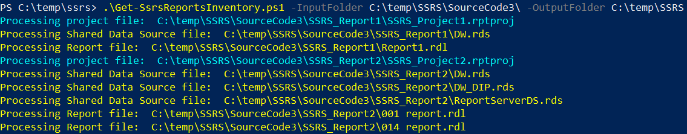

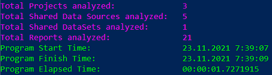

Script execution time varies and depends on the total number of packages and packages complexity. Typically it is in the range of seconds.

The script saves inventory information in CSV-files under **OutputFolder**. 

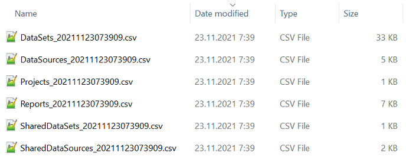

Files include:

- DataSets_YYYYMMDDHHmmss.csv - the list of report datasets (both embedded and referenced)
- DataSources_YYYYMMDDHHmmss.csv - the list of report data sources (both embedded and referenced)
- Projects_YYYYMMDDHHmmss.csv - the list of SSRS projects
- Reports_YYYYMMDDHHmmss.csv - the list of SSRS reports

- SharedDataSets_YYYYMMDDHHmmss.csv - the list of shared datasets 

- SharedDataSources_YYYYMMDDHHmmss.csv - the list of shared data sources 

  

# **Analyzing SSRS reports** #

When SSRS reports inventory is collected, it can be further analyzed using any analytics tool, such as Power BI, Excel, SQL, and others. Here, in the repository you can find a pre-configured Power BI report template [SSRS Assessment.pbit](SSRS Assessment.pbit).

> ###### Note
>
> To use the template you will need to have Power BI Desktop on your machine. The latest version can be downloaded from [Microsoft Downloads](https://aka.ms/pbiSingleInstaller) or [Microsoft Store](https://aka.ms/pbidesktopstore). 

## **Loading data into report**

To generate a new report, open a template in Power BI Desktop or simply double-click report template file name in Windows Explorer. Power BI Desktop will prompt for the path to inventory files. ***Do not change other parameters.***

The report loads all files by masks mentioned in the previous section. If there are multiple files then the content of all files will be combined. This means that [Get-SsrsReportsInventory.ps1](Get-SsrsReportsInventory.ps1) script can be executed over multiple source code folders and Power BI report will consolidate inventory data.

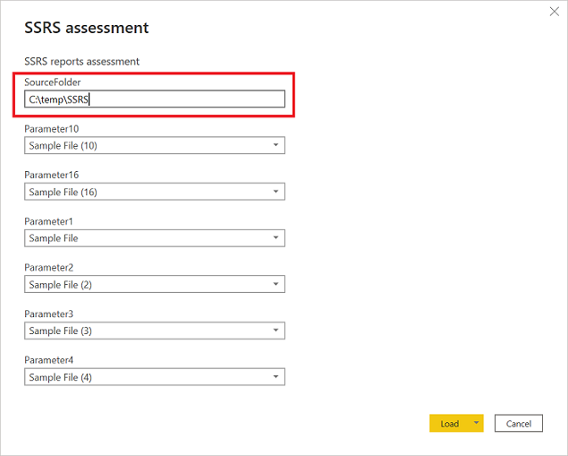

## **Summary**

**Summary** page provides the summary of all found projects and reports, incl. target SQL Server version, connection types in shared and embedded data sources, command types in shared and embedded datasets, number of used visuals by type, number of various features in use, incl. external assemblies (code modules), embedded code (code lines), Subreports, Embedded images, Document Map labels, Bookmarks, Actions (Boormark/Drillthrough/Hyperlink), ExecutionTime and UserId variables.

> ###### Note
>
> The following features are not supported in Power BI Paginated Reports:
>
> - **Shared Data Sources**
> - **Shared DataSets**
> - **Drillthrough actions**
> - **External Assemblies** and **Embedded Code**
>
> The behavior of **Document Map Labels** as well as **ExecutionTime** and **UserId** variables in Power BI Paginated Reports differs from SSRS, hence may require adjustments.

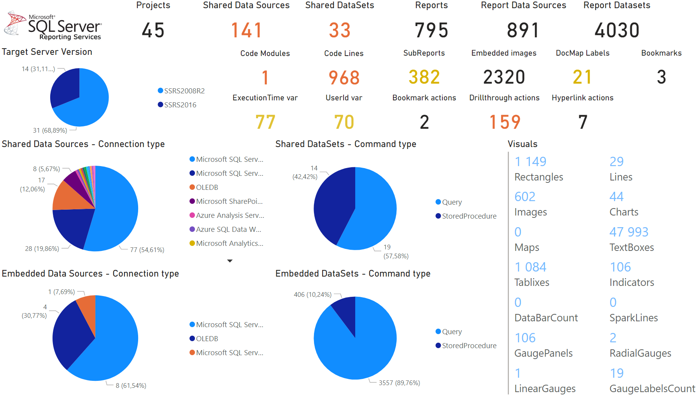

## **Shared Data Sources**

***Shared Data Sources*** page provides information about all found Shared Data Sources, including project, shared data source, and connection type (SQL Server, Azure SQL Data Warehouse, etc.).

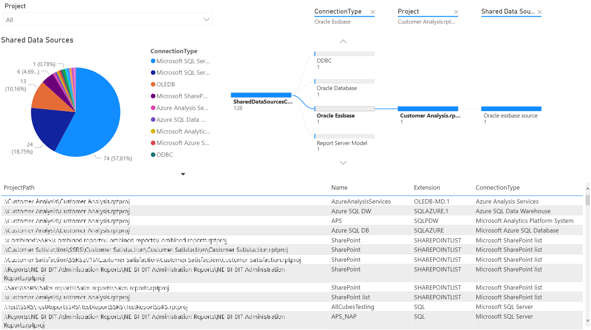

## **Embedded Data Sources**

***Embedded Data Sources*** page provides information about all found Data Sources which are embedded into reports, including project, report, data source name, and connection type.

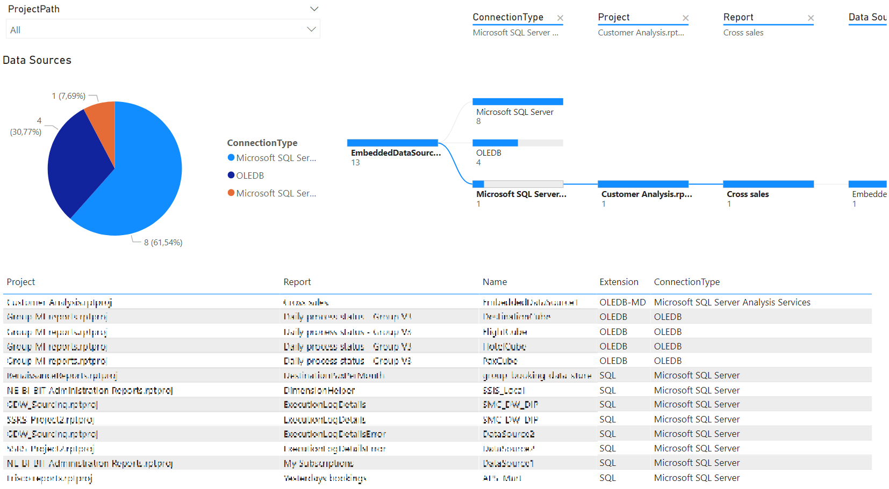

## **Connection Types**

***Connection Type*** Package page provides summary information about various types of connections found across all projects, both in Shared and Embedded Data Sources.

- Yellow background highlights connection types which are not supported in Power BI Paginated Reports. These include Microsoft SQL Server Analytics Platform System, Report Server Model, SharePoint list, Oracle Essbase, SAP BW, XML, OLEDB.
- Orange foreground highlights connection types which require Power BI enterprise gateway configuration. These include Microsoft SQL Server, Microsoft SQL Server Analysis Services, Oracle database, Teradata, ODBC.
- Blue background highlights ODBC connection type which require ODBC DSN configuration.

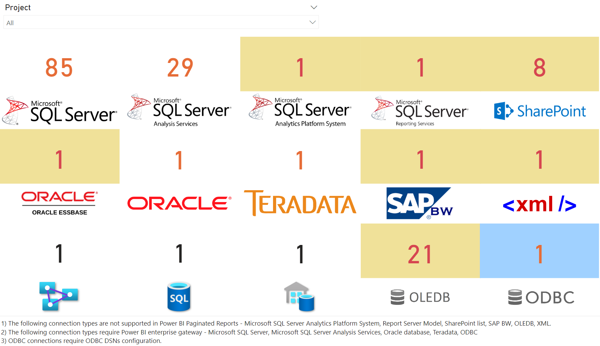

## **Shared Datasets**

***Shared Datasets*** page provides information about all found Shared Datasets, including project, dataset, command type, number of parameters / fields / calculated fields / data fields / filters.

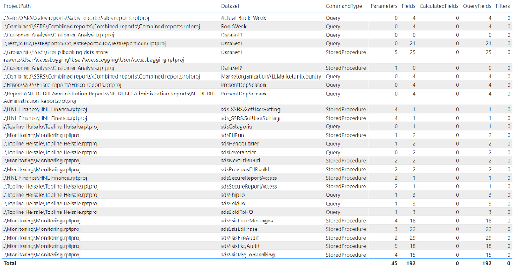

## **Embedded Datasets**

***Embedded Datasets*** page provides information about all found Datasets embedded into reports, including project, report, dataset, command type, number of parameters / fields / calculated fields / data fields / filters.

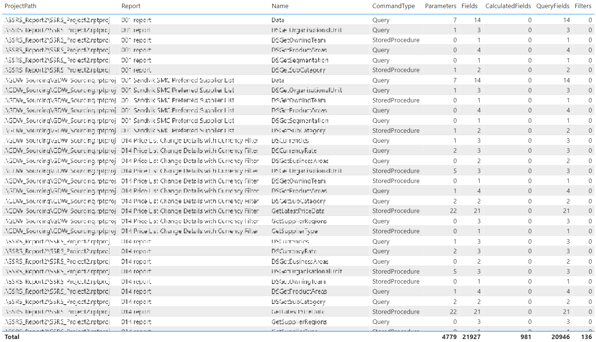

## Reports

***Reports*** page provides information about all found reports and features and visuals used in the reports.

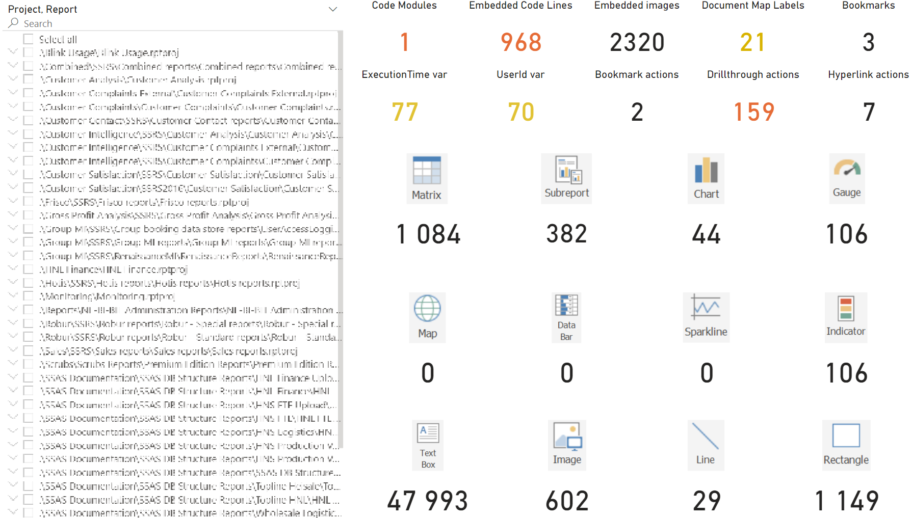

# Conclusion #

This toolkit enables data warehouse migration practitioners to perform SSRS reports analysis within literally minutes. This would help to shape migration strategy, including:

- Target platform definition, e.g. SSRS on VM, Power BI Paginated Reports, or another reporting tool.
- Possible blockers and/or items for further analysis and considerations.
- Migration efforts estimation.

