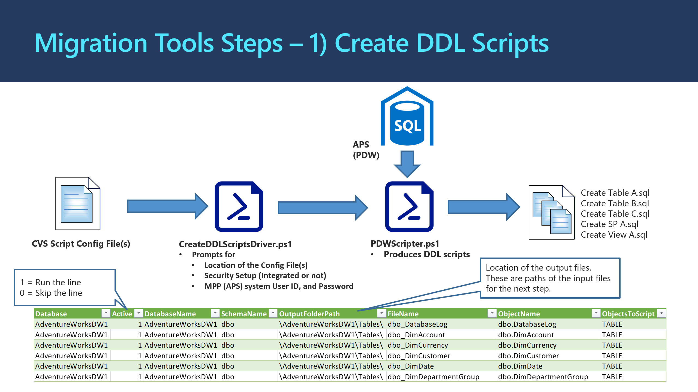

# 1_CreateDDLScripts: Creates DDL scripts from APS

The script processing logic and information flow is illustrated in the diagram below: 

## **How to Run the Script** ##

o  **Step 1A**: Prepare Configuration CSV Files to run migration tools step 1, create DDL scripts.

| **Parameter**    | **Purpose**                                                  |
| ---------------- | ------------------------------------------------------------ |
| Database         | Name of the DB to connect to                                 |
| Active           | 1 – Run  line, 0 – Skip line                                 |
| DatabaseName     | Name of the DB to connect to                                 |
| SchemaName       | Name of the object schema                                    |
| OutputFolderPath | Relative path where the .sql file should be saved. Must have “\” on end. |
| FileName         | Name of the file to store the script in. This should match the object name if  possible |
| ObjectName       | Name of  the object to script. This must include the schema. |
| ObjectToScript   | Used in logging only                                         |

> The repository contains sample files which you can use as a reference.
>
> You can also use the files generated by Assessment script. These include TablesToScript_CSV.csv, ViewsToScript_XXX.csv, SPsToScript_XXX.csv, IndexesToScript_XXX.csv, UsersToScript_XXX.csv, RolesToScript_XXX.csv.

o  **Step 1B**: Run PowerShell script **CreateDDLScriptsDriver.ps1**.
Provide  prompted information or accept default values. The script **CreateDDLScriptsDriver.ps1** will prompt for the following information:

- Location of the Config File(s)
- Security Setup (Integrated or not)
- MPP (APS) system User ID, and Password

o  **Output**: T-SQL DDL scripts for APS objects. Output files will be generated under Output folder path.