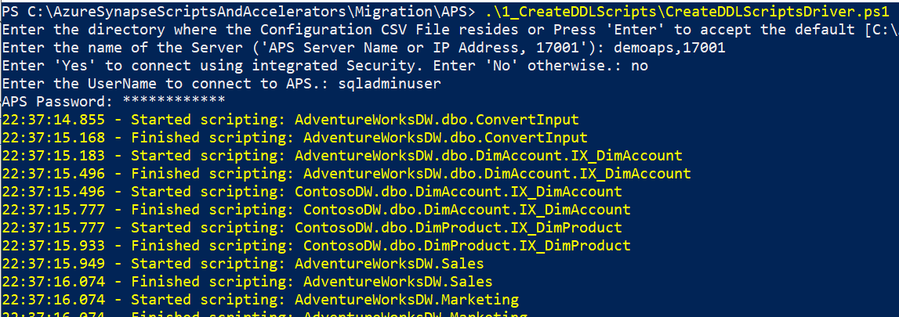
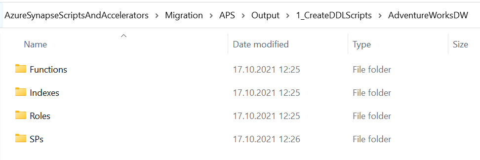

# 1_CreateDDLScripts: Creates DDL scripts from APS

The script processing logic and information flow is illustrated in the diagram below: 

## **What the Script Does** ##

The PowerShell script generates T-SQL scripts for APS schema objects. This includes:

- Tables
- Views
- Stored Procedures
- Functions
- Indexes
- Roles
- Users
- Statistics (user defined only) 

## **How to Run the Script** ##

1.  **Step 1A**: Prepare configuration CSV files used by CreateDDLScriptsDriver.ps1 script. The script can use multiple CSV files found in the same folder as the script itself. 
   You can use CSV files generated by Assessment script. These include ***TablesToScript_YYYYMMDDHHmmss.csv***, ***ViewsToScript_YYYYMMDDHHmmss.csv***, ***SPsToScript_YYYYMMDDHHmmss.csv***, ***IndexesToScript_YYYYMMDDHHmmss.csv***, ***UsersToScript_YYYYMMDDHHmmss.csv***, ***RolesToScript_YYYYMMDDHHmmss.csv***.

| **Parameter**    | **Purpose**                                                  |
| ---------------- | ------------------------------------------------------------ |
| Database         | Name of the DB to connect to                                 |
| Active           | 1 – Run  line, 0 – Skip line                                 |
| DatabaseName     | Name of the DB to connect to                                 |
| SchemaName       | Name of the object schema                                    |
| OutputFolderPath | Relative path where the .sql file should be saved. Must have “\” on end. |
| FileName         | Name of the file to store the script in. This should match the object name if  possible |
| ObjectName       | Name of  the object to script. This must include the schema. |
| ObjectToScript   | Used in logging only (TABLE, INDEX, STAT, FUNCTION, VIEW, SP, ROLE, USER) |

> The repository contains sample files which you can also use as a reference.
>

2.  **Step 1B**: Run PowerShell script [**CreateDDLScriptsDriver.ps1**](CreateDDLScriptsDriver.ps1) and enter prompted information or accept default values.
   - Path to the Config File(s)
   - Authentication mode (Integrated or SQL)
   - APS system User ID, and Password

## Output ##

Sample script output:

T-SQL DDL scripts for APS objects will be generated and stored in Output folder. The scripts are structured based on source database name and object type.

