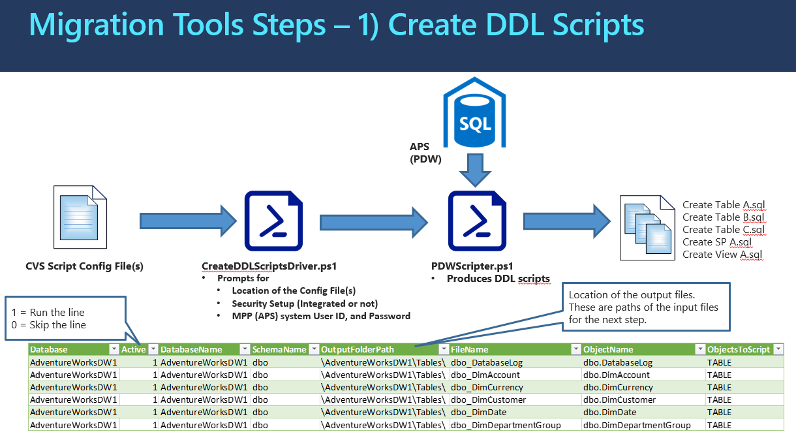

##1_CreateDDLScripts (PowerShell): Creates object creation scripts from APS

The program processing logic and information flow is illustrated in the diagram below: 

## **How to Run the Program** ##

o  **Step 1A**: Prepare Configuration CSV Files to run migration tools step 1, create DDL scripts 

| **Parameter**    | **Purpose**                                                  |
| ---------------- | ------------------------------------------------------------ |
| Database         | Name of  the DB to connect to                                |
| Active           | 1 – Run  line, 0 – Skip line                                 |
| DatabaseName     | Name of  the DB to connect to                                |
| SchemaName       | Name of  the object schema                                   |
| OutputFolderPath | Relative  path where the .sql file should be saved. Must have “\” on end. |
| FileName         | Name of  the file to store the script in. This should match the object name if  possible |
| ObjectName       | Name of  the object to script. This must include the schema. |
| ObjectToScript   | Used in  logging only                                        |

o  **Step 1B**: Run Create DDL Scripts(1_CreateDDLScripts.ps1).
Provide  prompted information or accept default values. The 1_CreateDDLScripts.ps1 will  prompt for the following information:

- Location of the Config File(s)
- Security Setup (Integrated or not)
- MPP (APS) system User ID, and Password

o  **Output**: T-SQL scripts for APS objects (DDLs and DMLs).Outputs will be generated under Ouput folder path.