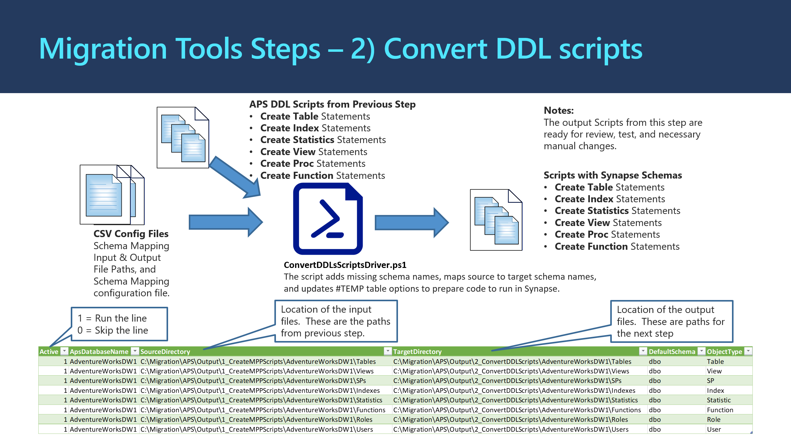

# **2_ConvertDDLScripts:** Translates APS DDL scripts to Azure Synapse DDL scripts.

The program processing logic and information flow is illustrated in the diagram below:

## **What the Script Does** ##

The PowerShell script converts T-SQL scripts for APS schema objects to make it Azure Synapse compatible. This includes:

- Add default schema name if schema name is missing in object references
- Schema replacement based on schema mapping
- Fixing #TEMP table options, incl. REPLICATE-->ROUND_ROBIN

## **How to Run the Script** ##

Below are the steps to run the PowerShell script: 

**Step 2A:** Prepare configuration files.
- Schema mapping file [schemas.csv](schemas.csv)

| **Parameter** | **Purpose**                            | **Value (Sample)** |
| ------------- | -------------------------------------- | ------------------ |
| ApsDbName     | Name of APS Database                   | AdventureWorksDW   |
| ApsSchema     | Name of the schema in APS database     | dbo                |
| SynapseSchema | Name of the schema in Synapse database | aw                 |

- Create input and output directory configuration CSV file [cs_dirs.csv](cs_dirs.csv)

| **Parameter**    | **Purpose**                                                  | **Value  (Sample)**                                      |
| ---------------- | ------------------------------------------------------------ | -------------------------------------------------------- |
| Active           | 1 – Run  line, 0 – Skip line                                 | 0 or 1                                                   |
| ApsDatabasesName | The  name of APS database                                    | AdventureWorksDW                                         |
| SourceDirectory  | Directory  where the input source files that has APS schema names. This is the output  files from previous step.  *Both absolute and relative paths are supported.* | ..\Output\1_CreateDDLScripts\AdventureWorksDW\Tables     |
| TargetDirectory  | Output  directory of this step, where the scripts with new Synapse schemas will reside. *Both absolute and relative paths are supported.* | ..\Output\2_ConvertDDLScripts\AdventureWorksDW\Tables    |
| DefaultSchema    | The  name of default schema for this database.  If schema name is missing in an object reference this default schema will be assumed. | dbo                                                      |
| ObjectType       | Type of  the object                                          | Table,  View, SP, Index, Statistic, Function, Role, User |

**Step 2B:** Run PowerShell script **ConvertDDLScriptsDriver.ps1** with the prompted information.

