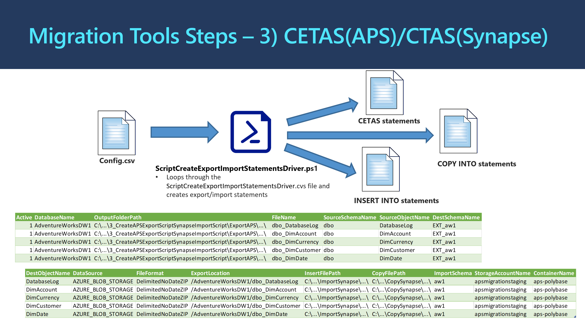

# **3_CreateAPSExportScriptSynapseImportScript:** Generates the export and import statements required to move the data from APS to Azure Synapse

The program processing logic and information flow is illustrated in the diagram below: 




## **What the Script Does** ##

The PowerShell script generates T-SQL scripts to export APS data into Azure Blob Storage. It also generates T-SQL Scripts to import exported data from Azure Blob Storage into Azure Synapse. 

The program generates the right structure, with the specified table, specified external data source name, the specified file format, and the specified location in Azure Blob Storage to store the data. All the specifications are set in the configuration driver CSV file. 

Below are example of the T-SQL scripts for one single table.

Sample generated T-SQL scripts to export APS table data into Azure Blob Storage:    

```sql
INTO aw.FactFinance
SELECT * FROM EXT_aw.FactFinance
OPTION (LABEL = 'Import_Table_aw.FactFinance')
CREATE EXTERNAL TABLE AdventureWorksDW.EXT_aw.FactFinance
WITH (
	LOCATION='/AdventureWorksDW/dbo_FactFinance',
	DATA_SOURCE = AZURE_STAGING_STORAGE,
	FILE_FORMAT = DelimitedFileFormat
)
AS 
SELECT * FROM AdventureWorksDW.dbo.FactFinance
OPTION (LABEL= 'Export_Table_AdventureWorksDW.dbo.FactFinance')
```

Sample generated T-SQL scripts to import data into Azure Blob Storage:

```sql
INTO aw.FactFinance
SELECT * FROM EXT_aw.FactFinance
OPTION (LABEL = 'Import_Table_aw.FactFinance')
```


## **How to Run the Script** ##

Below are the steps to run the PowerShell script: 

**Step 3A:** Prepare the configuration CSV file for PowerShell script. 
Create the configuration driver CSV File based on the definition below. Sample CSV configuration file is provided to aid this preparation task. 

There is also a job-aid PowerShell script called **Generate_Step3_ConfigFiles.ps1** which can help you to generate an initial configuration file for this step. This Generate_Step3_ConfigFiles.ps1 uses a driver configuration CSV file named **ConfigFileDriver_Step3.csv** which has instructions inside for each parameter to be set. 

Refer ***[Job Aid: Programmatically Generate Config Files](#job-aid:-programmatically-generate-config-files)*** after the steps for more details.

| **Parameter**      | **Purpose**                                                  | **Value (Sample)**                                           |
| ------------------ | ------------------------------------------------------------ | ------------------------------------------------------------ |
| Active             | 1 – Run line, 0 – Skip line                                  | 0 or 1                                                       |
| DatabaseName       | Name of the database in APS                                  | AdventureWorksDW                                             |
| OutputFolderPath   | Name of the path to output the  resulte to                   | ..\Output\3_CreateAPSExportScriptSynapseImportScript<br />\ExportAPS\AdventureWorksDW |
| FileName           | Name of the output file                                      | DimAccount                                                   |
| SourceSchemaName   | Name of the APS/Source Schema                                | dbo                                                          |
| SourceObjectName   | Name of the source object to work  with                      | DimAccount                                                   |
| DestSchemaName     | Name of the destination schema in  Synapse for external tables | EXT_aw                                                       |
| DestObjectName     | Name of the destination object                               | DimAccount                                                   |
| DataSource         | Name of the External Data Source to use. This must already be created. | AZURE_STAGING_STORAGE                                        |
| FileFormat         | Name of the External File Format to use  when exporting the data. This must already be created. | DelimitedFileFormat                                          |
| ExportLocation     | Folder path in the staging  container. Each Table should have its own file location. | /AdventureWorksDW/dbo_DimAccount                             |
| InsertFilePath     | Path to write the import  statements.<br />*Both absolute and relative paths are supported.* | ..\Output\3_CreateAPSExportScriptSynapseImportScript<br />\ImportSynapse\AdventureWorksDW\ |
| CopyFilePath       | Path to write the COPY statements.<br />*Both absolute and relative paths are supported.* | ..\Output\3_CreateAPSExportScriptSynapseImportScript<br />\CopySynapse\AdventureWorksDW\ |
| ImportSchema       | Name of the new schema in Synapse                            | aw                                                           |
| StorageAccountName | The name of Azure staging storage  account                   | apsmigrationstaging                                          |
| ContainerName      | The name of the container in Azure staging storage account   | aps-export                                                   |

**Step 3B:** 
Run PowerShell script **ScriptCreateExportImportStatementsDriver.ps1**. 
Provide the prompted information: The path and name of the Configuration Driver CSV File. The script does not connect to APS or Synapse.  The only input for this script is the [Config file](ConfigFileDriver_Step3.csv). 

> ###### Note 1
>
> Later before actually exporting data from APS you will need to have External Data Source and External File Format created in APS. You can use sample script [CreateExternalObjects.sql](CreateExternalObjects.sql) as a template. 

> ###### Note 2
>
> When exporting data from APS to Azure Blob Storage make sure that you Azure storage account is configured for **Minimum TLS Version 1.0**. Otherwise you may encounter an error when creating external tables.
>
> `CREATE EXTERNAL TABLE AS SELECT statement failed as the path name 'wasbs://container@storageaccount.blob.core.windows.net/DatabaseName/TableName' could not be used for export. Please ensure that the specified path is a directory which exists or can be created, and that files can be created in that directory.` 


## Job Aid: Programmatically Generate Config Files

There is a job-aid PowerShell script named **Generate_Step3_ConfigFiles.ps1** to help you to produce configuration file(s) programmatically. It uses output produced by previous steps (for example: T-SQL script files from step 3, and schema mapping file from step 3). 

It uses parameters set inside the file named **ConfigFileDriver_Step3.csv**. The CSV file contains fields as value-named pairs with instructions for each field. You can set the value for each named field based on your own setup and output files. 

After running the **Generate_Step3_ConfigFiles.ps1**, you can then review and edit the programmatically generated configuration files based on your own needs and environment. The generated config file(s) can then be used as input to the step 3 main script **ScriptCreateExportImportStatementsDriver.ps1**.


​    
