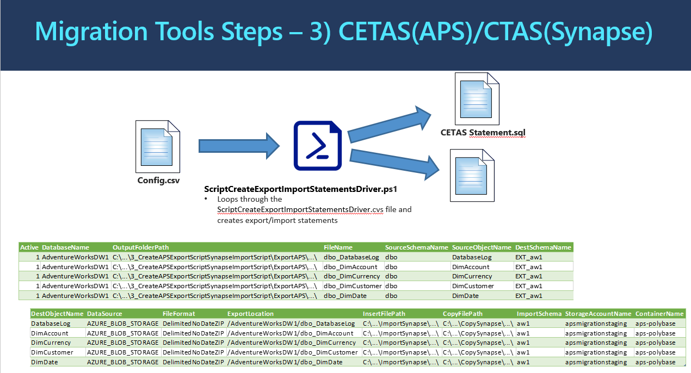

# **3_CreateAPSExportScriptSynapseImportScript(PowerShell):** Generate the export and import statements necessary to move the data from APS to Azure SQLDW

The program processing logic and information flow is illustrated in the diagram below: 

## **How to Run the Program** ##

Below are the steps to run the PowerShell Program(s): 

**Step 3A:** Prepare the configurationCSV file for the powershell program. 
Create the Configuration Driver CSV File based on the definition below. Sample CSV configuration file is provided to aid this preparation task. 

| **Parameter**      | **Purpose**                                                  | **Value (Sample)**                                           |
| ------------------ | ------------------------------------------------------------ | ------------------------------------------------------------ |
| Active             | 1 – Run line, 0 – Skip line                                  | 0 or 1                                                       |
| DatabaseName       | Name of the database in APS                                  | AdventureWorksDW                                             |
| OutputFolderPath   | Name of the path to output the  resulte to                   | C:\...\Migration\APS\Output\3_CreateAPSExportScriptSynapseImportScript\ExportAPS\AdventureWorksDW1 |
| FileName           | Name of the output file                                      | DimAccount                                                   |
| SourceSchemaName   | Name of the APS/Source Schema                                | Dbo                                                          |
| SourceObjectName   | Name of the source object to work  with                      | DimAccount                                                   |
| DestSchemaName     | Name of the destination schema in  Synapse                   | dbo                                                          |
| DestObjectName     | Name of the destination object                               | DimAccount                                                   |
| DataSource         | Name of the data source to  use. This must already be created. | AZURE_BLOB_STORAGE                                           |
| FileFormat         | Name of the File Format to use  when exporting the data. This must already be created. | DelimitedNoDateZip                                           |
| ExportLocation     | Folder path in the staging  container. Each Table should have its  own file location | /AdventureWorksDW1/dbo_DimAccount                            |
| InsertFilePath     | Path to write the import  statements                         | C:\...\Migration\APS\Output\3_CreateAPSExportScriptSynapseImportScript\ImportSynapse\AdventureWorksDW1\ |
| CopyFilePath       | Path to write the COPY statements                            | C:\...\Migration\APS\Output\3_CreateAPSExportScriptSynapseImportScript\CopySynapse\AdventureWorksDW1\ |
| ImportSchema       | Name of the new schema in Synapse                            | aw1                                                          |
| StorageAccountName | Name of the staging storage  account                         | Apsmigrationstaging                                          |
| ContainerName      | Name of the container in staging  storage account            | aps-Polybase                                                 |

There is also a Job-Aid PowerShell program called "**Generate_Step3_ConfigFiles.ps1**" which can help you to generate an initial configuration file for this step. This Generate_Step4_ConfigFiles.ps1 uses a driver configuration SCV file named "ConfigFileDriver.csv" which has instructions inside for each parameter to be set. 

## **Job Aid** - Programmatically Generate Config Files

There is a job-aid PowerShell script named "Generate_Step3_ConfigFiles.ps1" to help you to produce configuration file(s) programmatically. It uses output produced by previous steps (for example: T-SQL script files from step 3, and schema mapping file from step 3). 

It uses parameters set inside the file named "ConfigFileDriver_Step3.csv". The CSV file contains fields as value-named pairs with instructions for each field. You can set the value for each named field based on your own setup and output files. 

After running the "Generate_Step3_ConfigFiles.ps1", you can then review and edit the programmatically generated configuration files based on your own needs and environment. The generated config file(s) can then be used as input to the step 4 main program (ScriptCreateExportImportStatementsDriver.ps1).

**Step 3B:** 
Run the powershell script ScriptCreateExportImportStatementsDriver.ps1. 
Provide the prompted information: The path and name of the Configuration Driver CSV File. The script does not connect to the APS or SQLDW.  The only input for this script is the [Config file](ConfigFileDriver_Step3.csv). 

## **What the Program(s) Does** ##

The PowerShell Program generates the T-SQL Scripts to export APS data into Azure Blob Storage. It also generates the T-SQL Scripts to import exported data from Azure Blob Storage into Azure SQLDW. 

The program generates the right structure, with the specified table, specified external data source name, the specified file format, and the specified location in Azure Blob Storage to store the data. All the specifications are set in the configuration driver CSV file. 

Below are example of the T-SQL Scripts for one single table.

Sample generated T-SQL scripts to export APS Table into Azure Blob Storage:  
​     
    Create External Table adventure_works.ext_adw_dbo.ext_FactFinance
    WITH (
    	LOCATION='/prod/adventure_works/dbo_FactFinance',
    	DATA_SOURCE = AzureBlobDS,
    	FILE_FORMAT = DelimitedNoDateZIP
    	)
    AS 
    SELECT * FROM adventure_works.dbo.FactFinance
    Option(Label = 'Export_Table_adventure_works.dbo.FactFinance')

Sample generated T-SQL scripts to import data into Azure Blob Storage:

     INSERT INTO adw_dbo.FactFinance
      SELECT * FROM ext_adw_dbo.ext_FactFinance
    	Option(Label = 'Import_Table_adw_dbo.FactFinance')

​    
​    
