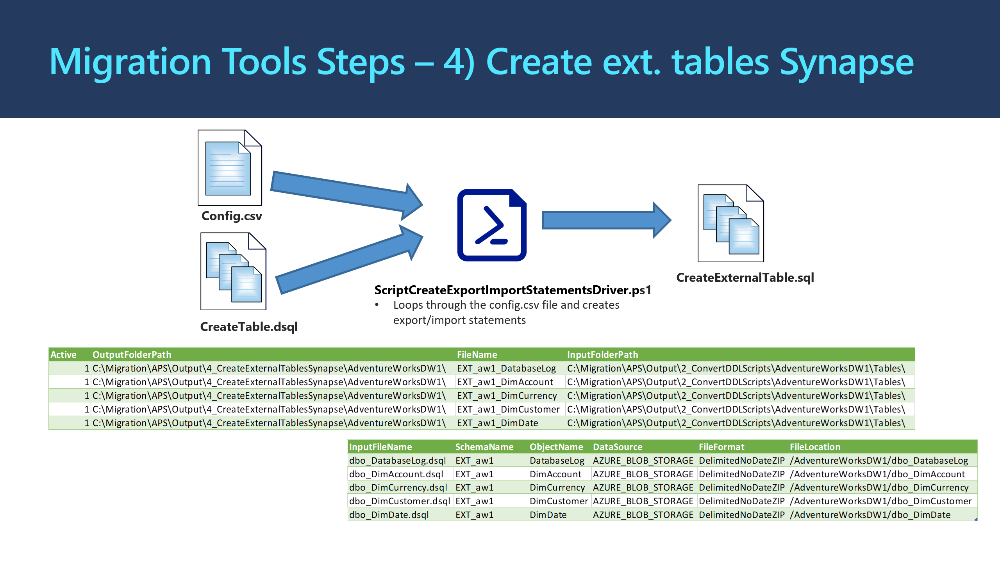

# **4_CreateExternalTablesSynapse:** Generate "Create External Table" DDLs for Azure Synapse

The program processing logic and information flow is illustrated in the diagram below: 



## What the Script Does

After the data has been exported from APS, the data now needs to be inserted into Synapse.  Before this can occur, the external table needs to be created in Azure Synapse.  This is completed by using the create table statements and converting the statement into an external table. This PowerShell script generates these CREATE EXTERNAL TABLE statements. 


Sample generated T-SQL scripts for External Table creation in Azure Synapse:  

```sql
CREATE EXTERNAL TABLE [ext_aw].[ext_FactFinance]
(
	[FinanceKey]	int	NOT NULL 
	,[DateKey]	int	NOT NULL 
	,[OrganizationKey]	int	NOT NULL 
	,[DepartmentGroupKey]	int	NOT NULL 
	,[ScenarioKey]	int	NOT NULL 
	,[AccountKey]	int	NOT NULL 
	,[Amount]	float	(53)	NOT NULL 
)
WITH (  
	LOCATION='/AdventureWorksDW/dbo_FactFinance',  
	DATA_SOURCE = AZURE_STAGING_STORAGE,  
	FILE_FORMAT = DelimitedFileFormat
)
```


## **How to Run the Script** ##

Below are the steps to run the PowerShell script: 

**Step 4A:** Create the configuration driver CSV file for the PowerShell script. 
Create the configuration driver CSV file based on the definition below. Sample CSV configuration file is provided to aid this preparation task. 

There is also a Job-Aid PowerShell script called **Generate_Step4_ConfigFiles.ps1** which can help you to generate an initial configuration file for this step. This Generate_Step5_ConfigFiles.ps1 uses a driver configuration CSV file named **ConfigFileDriver.csv** which has instructions inside for each parameter to be set. 

Refer ***[Job Aid: Programmatically Generate Config Files](#job-aid:-programmatically-generate-config-files)*** after the steps for more details.


| **Parameter**    | **Purpose**                                                  | **Value (Sample)**                                       |
| ---------------- | ------------------------------------------------------------ | -------------------------------------------------------- |
| Active           | 1 – Run line, 0 – Skip line                                  | 0 or 1                                                   |
| OutputFolderPath | Name of the path where output  files will be stored.<br />*Both absolute and relative paths are supported.* | ..\Output\4_CreateExternalTablesSynapse\AdventureWorksDW |
| FileName         | Name of the output file                                      | DimAccount                                               |
| InputFolderPath  | Path to the create Table output  from step 2.<br />*Both absolute and relative paths are supported.* | ..\Output\2_ConvertDDLScripts\AdventureWorksDW\Tables    |
| InputFileName    | Name of the Create Table script                              | DimAccount.dsql                                          |
| SchemaName       | Name of the schema to create the  external table in          | dbo                                                      |
| ObjectName       | Name of the external table to  create                        | ext_DimAccount                                           |
| DateSource       | Name of the data source to use  for the external table       | AZURE_STAGING_STORAGE                                    |
| FileFormat       | Name of the File Format to use  when exporting the data. Must already be created. | DelimitedFileFormat                                      |
| FileLocation     | Folder path in the staging  container. Each Table should have its  own file location. | /AdventureWorksDW/dbo_DimAccount                         |


If the FileLocation has the “{@Var}”, the PowerShell scripts will generate create external table having a configurable location. See sample T-SQL Statement generated below. 

This configurable variable {@Var} can be replaced with a value such as: 

**test** – to import data to a location to hold test data

**dev** – to import data to a locate to hold dev data

**prod** – to import data to a location to hold prod data. 

Sample Generated File: ext_aw_dbo_DimAccount.sql 

```sql
CREATE EXTERNAL TABLE [ext_aw].[ext_DimAccount]
(
	[AccountKey]	int	NOT NULL 
	,[ParentAccountKey]	int	NULL 
	,[AccountCodeAlternateKey]	int	NULL 
	,[ParentAccountCodeAlternateKey]	int NULL 
	,[AccountDescription]	nvarchar	(50)	
	,[AccountType]	nvarchar	(50)
    ,[Operator]	nvarchar	(50)
	,[CustomMembers]	nvarchar	(300)		
    ,[ValueType]	nvarchar	(50)
	,[CustomMemberOptions]	nvarchar	(200)	
)
WITH (  
	LOCATION='/AdventureWorksDW/dbo_DimAccount',  
	DATA_SOURCE = AZURE_STAGING_STORAGE,  
	FILE_FORMAT = DelimitedFileFormat
)
```

**Step 4B:** Run the script **ScriptCreateExternalTableDriver.ps1**. Provide the prompted information: The path and name of the configuration driver CSV file. The script does not connect to the APS or Synapse. The only input for this script is the config.csv file. 


## Job Aid: Programmatically Generate Config Files

There is a job-aid PowerShell script named **Generate_Step4_ConfigFiles.ps1** to help you to produce configuration file(s) programmatically. It uses output produced by previous steps (for example: T-SQL script files from step 2, schema mapping file from step 2, and Export & Import T-SQL scripts generated from Step 3). 

It uses parameters set inside the file named **ConfigFileDriver_Step4.csv**. The CSV file contains fields as value-named pairs with instructions for each field. You can set the value for each named field based on your own setup and output files. 

After running the **Generate_Step4_ConfigFiles.ps1**, you can then review and edit the programmatically generated configuration files based on your own needs and environment. The generated config file(s) can then be used as input to the step 4 main script (PowerShell: **ScriptCreateExternalTableDriver.ps1**).
