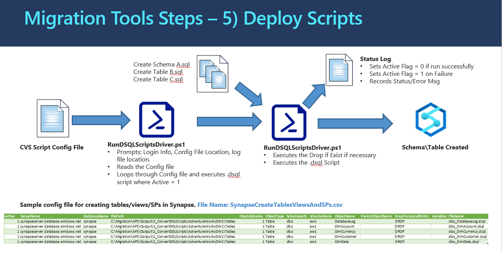

# **5_DeployScripts (PowerShell):** Deploy Generated T-SQL Scripts for Exporting APS Data and Importing Data into Azure SQLDW 
The Deployment script is designed to run any .sql file.  For the purpose of the migration, it can be used to deploy objects to APS or Azure SQLDW.  This tool can drop an existing object before running the .sql file.

The program processing logic and information flow is illustrated in the diagram below: 

## **What the Program(s) Does** ##

This PowerShell program connects to a specified MPP system (APS or Azure SQLDW), runs the T-SQL Scripts specified in the configuration driver CSV file(s). The T-SQL Scripts are in the following three categories:

1. Export APS Data into Azure Blob Storage by using T-SQL CTAS statements that create external tables reside in Azure SQLDW and insert data into the external tables from APS tables. 
2. Create Table, View, Stored Procedures, and External Tables in Azure SQLDW.
3. Import Data into Azure SQLDW from Azure Blob Storage 

## How to Run the Program ##

Below are the steps to run the PowerShell Program(s): 

**Step 5A:** Copy the Scripts from Source Repository and Place them on in a local directory.

* Any directory structure will work.  As a suggestion this path can be used: C:\AzureSynapseScriptsAndAccelerators\Migration\APS\5_DeployScriptsToSynapse.
* Place the two PowerShell scripts in the above directory (RunDSQLScriptDriver.ps1 and RunSQLScriptFile.ps1)
* You can choose to put all your CSV configuration files under the above directory, or in a separate directory under it, such as: C:\AzureSynapseScriptsAndAccelerators\Migration\APS\5_DeployScriptsToSynapse\Config_Files

**Step 5B:** Select one of the sample configuration files for the purpose of your deployment. All the three sample configuration files use the same format. Sample configuration files provided:

* Export APS Data to Azure Blob Storage: ApsCreateExtTablesAndExportData.csv
* Create Tables/Views/SPs in Azure SQLDW:  SqldwCreateTablesViewsAndSPs.csv
* Import APS Data to Azure Blob Storage: SqldwImportData.csv 

Edit the one of the sample config files to fit the purpose of your deployment. Refer the below details for the configuration.

| **Parameter**    | **Purpose**                                                  | **Value  (Sample)**                                          |
| ---------------- | ------------------------------------------------------------ | ------------------------------------------------------------ |
| Active           | 1 – Run line, 0 – Skip line                                  | 0 or 1                                                       |
| ServerName       | Name of the SQL  Server/Synapse/APS(PDW)                     | synapseserver.database.windows.net                           |
| DatabaseName     | Name of the DB to connect to                                 | AdventureWorksDW                                             |
| FilePath         | Path to the script that needs to  be run. Do not put a ‘\’ on the end. | C:\AzureSynapseScriptsAndAccelerators\Migration\APS\Output\2_ConvertDDLScripts\AdventureWorksDW1\Tables |
| CreateSchema     | 1 – Create Schema, 0 – Don’t  create Schema                  | 0 or 1                                                       |
| ObjectType       | Type of object to Create. Used to create the drop statement. Valid Values: “”, TABLE, VIEW, SP, (SCHEMA,  STAT – Not implemented yet) | TABLE, VIEW, SP, SCHEMA, EXT                                 |
| SchemaAuth       | Should a Schema Authorization be needed when  creating the schema, enter the name of the Authorization to use. If left  empty, no authorization is created. | Login to Create Schema                                       |
| SchemaName       | Schema Name for the object to be  created.                   | aw1                                                          |
| ObjectName       | Name of the object that is being  created. Used in creating the drop statement and logging. | Name of the object                                           |
| ParentObjectName | Name of the parent object. Valid  for statistics and indexes. | DimAccount                                                   |
| DropIfExists     | DROP – Drop object if already exists,  TRUNCATE - Truncate Table if exists, NO – Do not drop or Truncate if exist. | DROP                                                         |
| FileName         | The name of the script file                                  | dbo_DimAccount.dsql                                          |

There is also a Job-Aid PowerShell program called "**Generate_Step5_ConfigFiles.ps1**" which can help you to generate an initial configuration file for this step. This Generate_Step5_ConfigFiles.ps1 uses a driver configuration SCV file named "ConfigFileDriver.csv" which has instructions inside for each parameter to be set. 

**Step 5C:** Run the PowerShell script(RunDSQLScriptsDriver.ps1).  This script will prompt for the following information

- “Enter the name of the Script Config csv File.” – This will be the location\name of your configuration file.
C:\AzureSynapseScriptsAndAccelerators\Migration\APS\5_DeployScriptsToSynapse: SynapseCreateTablesViewsAndSPs.csv or ApsCreateExtTablesAndExportData.csv or SynapseImportData.csv 
- “How do you want to connect to SQL(ADPass, ADInt, WinInt, SQLAuth)?”
	ADPass – This should be used for SQL Authentication with Password (Azure)
	ADINT – Azure AD Authentication
	SQLAUTH – SQL Server Authentication with username and password.
	“Blank” – AD integrated Authentication
- “Enter the User Name to Connect to the SQL Server.” – User name with permission to create objects
- “Enter the Password for the User” – Enter the Password for the user – reads password as a secure string
- “Enter the name of the Output File Directory.” – Enter the location where the output log will be written
- “Enter the name of the status file.” – Enter the name of the Status File

**Step 5D:** Review the Status log for Success Failures. Review the status log file. The file name and location are the prompted values of the PowerShell program in step 5C. The default location is the location of the PowerShell scripts with the file name status.csv. 

* Should a failure occur, the Status log will set the Active flag to 0 for all successful objects created  The Failures will remain Active = 1.  This will allow the status log to be used as the Script Config file and only the failed objects will be run

## **Job Aid** - Programmatically Generate Config Files

There is a job-aid PowerShell script named "Generate_Step5_ConfigFiles.ps1" to help you to produce configuration file(s) programmatically. It uses output produced by previous steps (for example: T-SQL script files from module 2, schema mapping file from module 2, Export & Import T-SQL scripts generated from module 3, and T-SQL files for creating external tables generated in module 4). 

It uses parameters set inside the file named "ConfigFileDriver_Step5.csv". The CSV file contains fields as value-named pairs with instructions for each field. You can set the value for each named field based on your own setup and output files. 

After running the "Generate_Step5_ConfigFiles.ps1", you can then review and edit the programmatically generated configuration files based on your own needs and environment. The generated config file(s) can then be used as input to the step 6 main program (PowerShell: RunDSQLScriptsDriver.ps1).

​    
