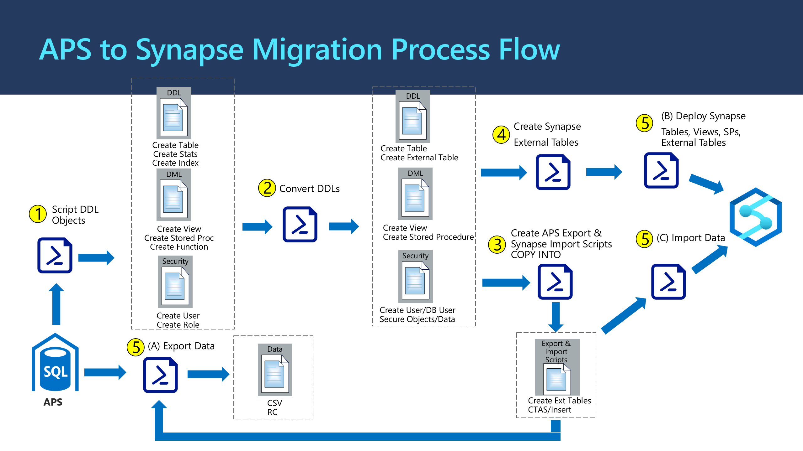

# **Table Of Contents**
 - [Overview](#overview) 
 - [Migration Tool Process Flow](#Migration Tools Process Flow)
 - [What does the Migration Utilities do](#What do the Migration Tools do?)
 - [What are in the Migration Utilities](#What is in the Migration Tools?)
  - [Contact Information](#contact-information)

## Overview

This directory contains APS to Azure Synapse migration toolkit. It includes the process flow, PowerShell script modules and configuration required in each module.

Below documents provide detailed information to help you get started.

- [**APS2Synapse_Migration.pptx**](https://github.com/microsoft/AzureSynapseScriptsAndAccelerators/blob/main/Migration/APS/APS2Synapse_Migration.pptx) 
- [**Migration/APS/APS_Migration_Considerations_Github.pptx**](https://github.com/microsoft/AzureSynapseScriptsAndAccelerators/blob/main/Migration/APS/Migration/APS/APS_Migration_Considerations_Github.pptx) 
- [**APS-to-Azure-Synapse-Analytics-Migration-Guide-Draft-V1.2.docx**](https://github.com/microsoft/AzureSynapseScriptsAndAccelerators/blob/main/Migration/APS/APS-to-Azure-Synapse-Analytics-Migration-Guide-Draft-V1.2.docx) 

## Migration Tools Process Flow

## What do the Migration Tools do?

The set of PowerShell Scripts performs below functions:

- Generates object creation scripts from source APS environment
- Translates APS object creation scripts to the Azure Synapse designs
- Generates APS export scripts to create the APS external tables to write data to Azure blob storage.
- Generates Synapse import scripts to load data from Azure blob storage to Synapse environment.
- Generates Synapse external table scripts
- Deploy/Execute the scripts to Synapse environment.

## What is in the Migration Tools?

There are 5 modules that contain PowerShell scripts and T-SQL scripts designed to accomplish key tasks that are relevant to APS to Azure Synapse migration.

Five modules are summarized below.

- [1_CreateDDLScripts]: /Migration/APS/1_CreateDDLScripts	"1_CreateDDLScripts"

    **:** Generates the APS objects creation scripts.

- [**1_CreateDDLScripts**](1_CreateDDLScripts/readme.md) - Generates the APS objects creation scripts (lower case)

- [**1_CreateDDLScripts**](1_CreateDDLScripts/README.md) - Generates the APS objects creation scripts (upper case)

- **1_CreateDDLScripts**: Generates the APS objects creation scripts.

- **2_ConvertDDLScripts:** Translates/generates the Synapse objects creation scripts from the objects listed from the step 1

- **3_CreateAPSExportScriptSynapseImportScript:** 
    
    - Generates APS external table scripts to write data to Azure blob storage
    - Generates COPY INTO scripts to load data into Azure Synapse tables 
    - Generates import scripts to load data from Azure external tables into Azure Synapse tables.
    
- **4_CreateExternalTablesSynapse:** Generates scripts to create Azure Synapse external tables

- **5_DeployScriptsToSynapse:** 
    This module can be used to execute/deploy any scripts to the Synapse environment.
    
    - To create Synapse schema objects (tables, views, stored procedures, indexes, roles, users, statistics)
    - To create Synapse external tables
    - To import data from Azure external tables into Azure Synapse user tables.
    
    

## Contact Information

Please send an email to AMA architects at <AMAArchitects@service.microsoft.com> for any issues regarding this tool.
