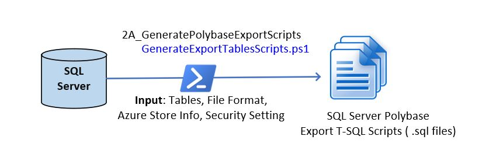

# **Module 2A_GeneratePolybaseExportScripts**

Use module **2A_GeneratePolybaseExportScripts** to generate Polybase Export T-SQL Script for each table. The function is illustrated in the figure below:

You will need to configuration files: **export_tables_config.json** and **ExportTablesConfig.csv**. For your convenience we provided a sample configuration files to guide you to create one for your own Azure Synapse instance. 

In addition, in the subfolder Utilities, we also provided sample code for setting up Polybase export and creating external data source, creating external file format, and creating external table. 

The definition and sample values for each row of the **export_tables_config.json** file s described in below table:

| Parameter Name     | Description                                                  | Values (Sample)                                              |
| ------------------ | ------------------------------------------------------------ | ------------------------------------------------------------ |
| ServerName         | Fully qualified SQL Server Name                              | .\\YourSQLServerName or  YourServerName.eastus2.cloudapp.azure.com |
| IntegratedSecurity | YES or NO for IntegratedSecurity                             | YES, NO.                                                     |
| TableColumns       | YES or NO for TableColumns (If  Yes, Columns will be created for each SQL Table in Create External Table  Script. | YES, NO.                                                     |
| RootFolder         | Folder Under Container where the data will  be uploaded. If it is blank (white space), data will be loaded under  container | Folder1 or Blank (white space)                               |
| DataSourceName     | The name of the external data source created  by setting up Polybase Export. Please refer to the subfolder Utilities for  examples of T-SQL scripts for setting up your | The value must match what you have defined  in “Create External Data Source). |
| FileFormatName     | The name of the external file foramt created  by setting up Polybase Export. Please refer to the subfolder Utilities for  examples of T-SQL scripts for setting up your | The value must match what you have defined  in “Create External File Format”). |
| SqlFilesFolder     | The Folder Name where all the output  T-SQL Scripts are stored. | C:\\migratemaster\\output\\2A_GeneratePolybaseExportScripts  |

The definition and sample values for each row of the **ExportTablesConfig.csv** file s described in below table:

| Parameter Name     | Description                                                  | Values (Sample)              |
| ------------------ | ------------------------------------------------------------ | ---------------------------- |
| Active             | 1 – Run line,  0 – Skip line.                                | 0 or 1                       |
| DatabaseName       | Database Name                                                | AdventureWorksDW2017         |
| SchemaName         | SQL Server Schema Name                                       | dbo                          |
| TableName          | SQL Server Table Name                                        | DimCustomer                  |
| ExternalSchemaName | Schema for the external table to be created.  You must create this schema in SQL server first. | Any valid schema name.       |
| DropExternalTable  | Yes if the previous external table with same  name needs to be dropped. | Yes or No. Case Insensitive. |

