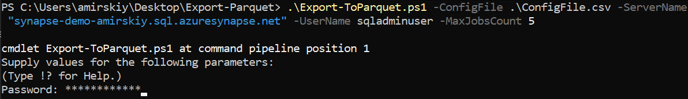
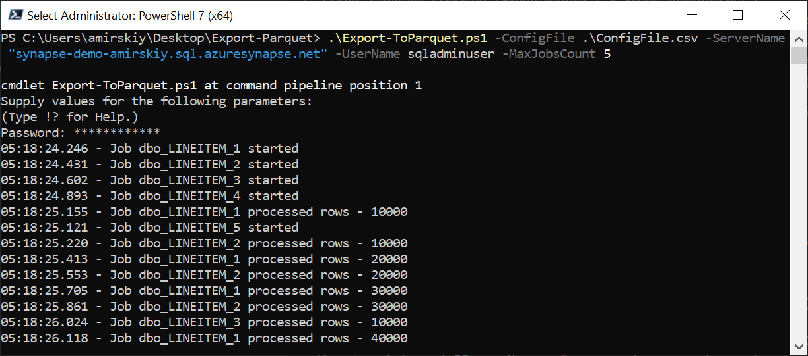
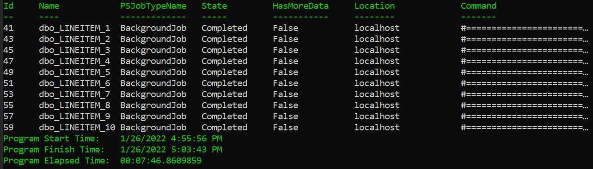
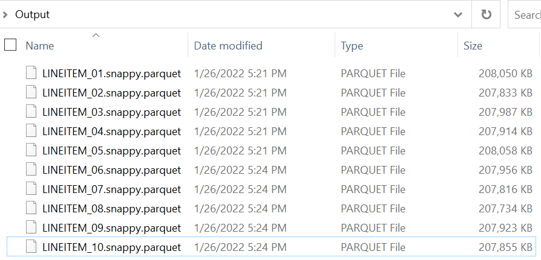

[TOC]

## Introduction

When executing databases / data warehouses migration, there is always need for data migration. In complex scenarios there are such services as Azure Data Factory, Azure Database Migration Service, AWS DMS, GCP Database Migration Service, which help to establish robust and reliable data migration process. However, sometimes there is a need to start quicker and use lightweight tool without incurring extra cost and/or infrastructure complexity.

This tool fits the purpose and provides capability to programmatically extract data from SQL family databases (SQL Server, APS/PDW, Azure SQL DB, Azure SQL MI) to Parquet-files which can be later ingested into data lakes or MPP data warehouses, for example Azure Synapse. 

After extracting data from on-premises databases, Parquet-files can be uploaded to the cloud using any available transport such as [azcopy](https://docs.microsoft.com/en-us/azure/storage/common/storage-use-azcopy-v10) tool, [Azure Storage Explorer](https://www.storageexplorer.com/), [Azure Data Box](https://docs.microsoft.com/en-us/azure/databox/data-box-overview), or other similar tools.

Sample scenarios where this tool might be useful include:

- extracting sample dataset for PoC (Proof of Concept)
- extracting historical cold dataset for further data transfer to cloud storage over wire or using storage appliances such as Azure Data Box
- extracting data when there are technical restrictions or limitations, for example:
  - installing 3rd party software is not possible
  - network bandwidth available for data extraction is limited
  - using cloud services for data extraction is undesirable due to costs, infrastructure complexity, or other concerns. 

> Note that currently only **SQL Server family** source databases are supported. These include:
>
> - SQL Server 2005 or higher
> - Parallel Data Warehouse (PDW)
> - Analytics Platform System (APS)
> - Azure SQL Database
> - Azure SQL Managed Instance
>
> Only **SQL authentication** (user name / password) is currently supported.


## Syntax

```powershell
.\Export-Parquet.ps1
	[[-ConfigFile] <String>]
	[-ServerName] <String>
	[-Database] <String>
	[-UserName] <String>
	[-Password] <SecureString>
	[[-ConnectionTimeout] <Integer>]
	[[-CommandTimeout] <Integer>]
	[[-RowsPerRowGroup] <Integer>]
	[[-MaxJobsCount] <Integer>]
	[-UserParquetNet]
	[<CommonParameters>]
```


## Description

The script [Export-ToParquet.ps1](Export-ToParquet.ps1) implements a parallel data extraction driven by configuration file and using one of two possible libraries to generate Parquet-files. These include [Parquet.Net](https://www.nuget.org/packages/Parquet.Net/) and [ParquetSharp](https://www.nuget.org/packages/ParquetSharp/) (used by default).

> Note that the script requires PowerShell version 7 or newer which can be downloaded [here](https://docs.microsoft.com/en-us/powershell/scripting/install/installing-powershell-on-windows?view=powershell-7.2) (Windows version). When executing the script using PowerShell older version, the script will throw a runtime error.

In short the logic of the script can be described as below:

1. Download and unpack either [Parquet.Net](https://www.nuget.org/packages/Parquet.Net/) or[ParquetSharp](https://www.nuget.org/packages/ParquetSharp/) NuGet-package.

2. Read configuration file.

3. Loop through the list of records found in the configuration file.

4. For every active (Enabled=1) record start a new background job which executes either Export-Table.ps1 or Export-Table_v2.ps1 script with corresponding parameter values.

5. Every background job
   - opens a connection to source database
   - executes SELECT-statement 
   - reads data in streaming mode
   - stores data in Parquet-file
   
6. Wait until all jobs are completed.

   

> Note that currently there are limitations which include:
>
> - **SQL Authentication** (user name / password) only
>
> - **SQL Server family** database only. These include:
>
>   - SQL Server 2005 or higher
>
>   - Parallel Data Warehouse (PDW)
>
>   - Analytics Platform System (APS)
>
>   - Azure SQL Database
>
>   - Azure SQL Managed Instance
>
> - **Supported data types** include:
>
>   - int, tinyint, smallint, bigint
>   - bit
>   - char, nchar, varchar, nvarchar
>   - real, float
>   - decimal, numeric, money, smallmoney
>   - date, time, datetime, datetime2, smalldatetime, datetimeoffset
>   - binary, varbinary


The toolkit includes:

- [Export-ToParquet.ps1](Export-ToParquet.ps1) - main PowerShell-script
- [Export-ParquetSharp.ps1](Export-ParquetSharp.ps1) - PowerShell-script which exports data based on a single SELECT-statement using ParquetSharp library
- [Export-ParquetNet.ps1](Export-ParquetNet.ps1) - PowerShell-script which exports data based on a single SELECT-statement using Parquet.Net library
- [ConfigFile.csv](ConfigFile.csv) - sample configuration file


## Examples

Sample command:

```yaml
.\Export-ToParquet.ps1 -ConfigFile .\ConfigFile.csv -ServerName "synapse-demo.sql.azuresynapse.net" -UserName sqladminuser -MaxJobsCount 5
```



Once all required parameters are provided, the script starts execution and reports progress for every background job.



Once completed the script reports the status of all jobs and total execution time.



The output folder contains extracted data stored in Parquet-files.



## Parameters

### -ConfigFile

Specifies the path to configuration file. Can be either absolute or relative path.

```yaml
Type: string
Required: False
Position: Named
Default value: $PSScriptRoot\ConfigFile.csv
```

### -ServerName

Specifies the name of SQL Server / APS / PDW / Azure Synapse instance. Can be FQDN-name or IP-address.

```yaml
Type: string
Required: True
Position: Named
Default value: None
```

### -Database

Specifies the name of database from which data will be extracted.

```yaml
Type: string
Required: True
Position: Named
Default value: None
```

### -UserName

Specifies the user name to connect to source SQL Server / APS / PDW / Azure Synapse instance (SQL authentication).

```yaml
Type: string
Required: True
Position: Named
Default value: None
```

### -Password

Specifies the password to connect to source SQL Server / APS / PDW / Azure Synapse instance (SQL authentication).

```yaml
Type: SecureString
Required: True
Position: Named
Default value: None
```

### -ConnectionTimeout

Specifies the connection timeout when establishing a connection to source SQL Server / APS / PDW / Azure Synapse instance.

```yaml
Type: integer
Required: False
Position: Named
Default value: 10
```

### -CommandTimeout

Specifies the query timeout when executing SELECT queries.

```yaml
Type: integer
Required: False
Position: Named
Default value: 30
```

### -RowsPerRowGroup

Specifies the maximum number of rows per single Parquet row group.

```yaml
Type: integer
Required: False
Position: Named
Default value: 10000000
```

### -MaxJobsCount

Specifies the maximum number of extraction jobs running simultaneously.

```yaml
Type: integer
Required: False
Position: Named
Default value: 5
```

### -UseParquetNet

Specifies if the script should use [Parquet.Net](https://www.nuget.org/packages/Parquet.Net/) library rather than default [ParquetSharp](https://www.nuget.org/packages/ParquetSharp/).

```yaml
Type: switch
Required: False
Position: Named
Default value: None
```


## Configuration file structure

| **Column** | **Purpose**                                                  |
| ---------- | ------------------------------------------------------------ |
| Enabled    | 1 - use current line for extracting data; 0 - skip current line. |
| Database   | The name of source database.                                 |
| Table      | The name of source table.                                    |
| Query      | SELECT statement to retrieve source data.                    |
| FilePath   | The path to Parquet-file where extracted data will be stored. Both relative and absolute paths are supported. |

```
Enabled,Database,Table,Query,FilePath
1,"TPCH","dbo.LINEITEM","select * from LINEITEM where L_ORDERKEY between 1 and 10000000",".\Output\LINEITEM_01.snappy.parquet"
1,"TPCH","dbo.LINEITEM","select * from LINEITEM where L_ORDERKEY between 10000001 and 20000000",".\Output\LINEITEM_02.snappy.parquet"
1,"TPCH","dbo.LINEITEM","select * from LINEITEM where L_ORDERKEY between 20000001 and 30000000",".\Output\LINEITEM_03.snappy.parquet"
1,"TPCH","dbo.LINEITEM","select * from LINEITEM where L_ORDERKEY between 30000001 and 40000000",".\Output\LINEITEM_04.snappy.parquet"
1,"TPCH","dbo.LINEITEM","select * from LINEITEM where L_ORDERKEY between 40000001 and 50000000",".\Output\LINEITEM_05.snappy.parquet"
1,"TPCH","dbo.LINEITEM","select * from LINEITEM where L_ORDERKEY between 50000001 and 60000000",".\Output\LINEITEM_06.snappy.parquet"
```


## Conclusion ##

This simple script provides data warehouse migration practitioners with simple lightweight yet efficient capability to extract data from source database or data warehouse into Parquet-files which are ready for consumption in data lakes or for ingestion into Azure Synapse Dedicated SQL Pool using [COPY INTO](https://docs.microsoft.com/en-us/sql/t-sql/statements/copy-into-transact-sql?view=azure-sqldw-latest) command.

