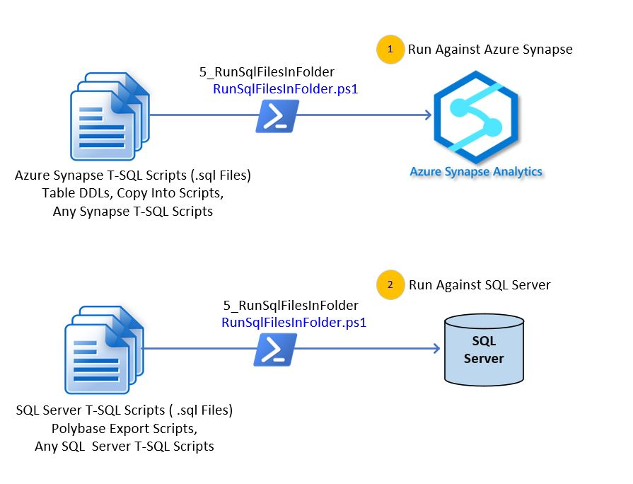

# **Module 5_RunSqlScriptsInFolder**

Use module **5_RunSqlFilesinFolder** to Execute all T-SQL Scripts (.sql files) stored in a specified folder.  The multi-purpose functions are illustrated in the figure below:

You can use this module to execute the T-SQL Scripts generated by below methods:

(1)  **1_TranslateMetaData** (output of this module)

(2)  **2A_GeneratePolybaseExportScripts** (output of this module)

(3)  **4_GenerateCopyIntoScripts** (output of this module)

(4)  Any prepared T-SQL Scripts stored in a specified folder (to run against a SQL Server or Azure Synapse Analytics).

You need to run **RunSqlFilesInFolder.ps1** with only one configuration file: **sql_scripts.json**. For your convenience we provided a sample **sql_synapse.json** to guide you to create one for your own Azure Synapse instance. 

The definition and sample values for each parameter of **sql_scripts.json** are described in below table

| Parameter Name     | Description                                              | Values (Sample)                                              |
| ------------------ | -------------------------------------------------------- | ------------------------------------------------------------ |
| ServerName         | Fully qualified SQL Server Name                          | .\\\YourSQLServerName or  yourSynapseWorkSpaceName.sql.azuresynapse.net |
| DatabaseName       | Database Name                                            | SqlDatabaseNameHere (or SynapseSqlPoolDbName)                |
| IntegratedSecurity | YES or NO for IntegratedSecurity                         | YES, NO. Use the value "YES" if you have Integrated Security |
| SqlFilesFolder     | The Folder Name where all the  T-SQL Scripts are stored. | C:\\\migratemaster\\output\\\4_GenerateCopyIntoScripts\\\CsvMi |

