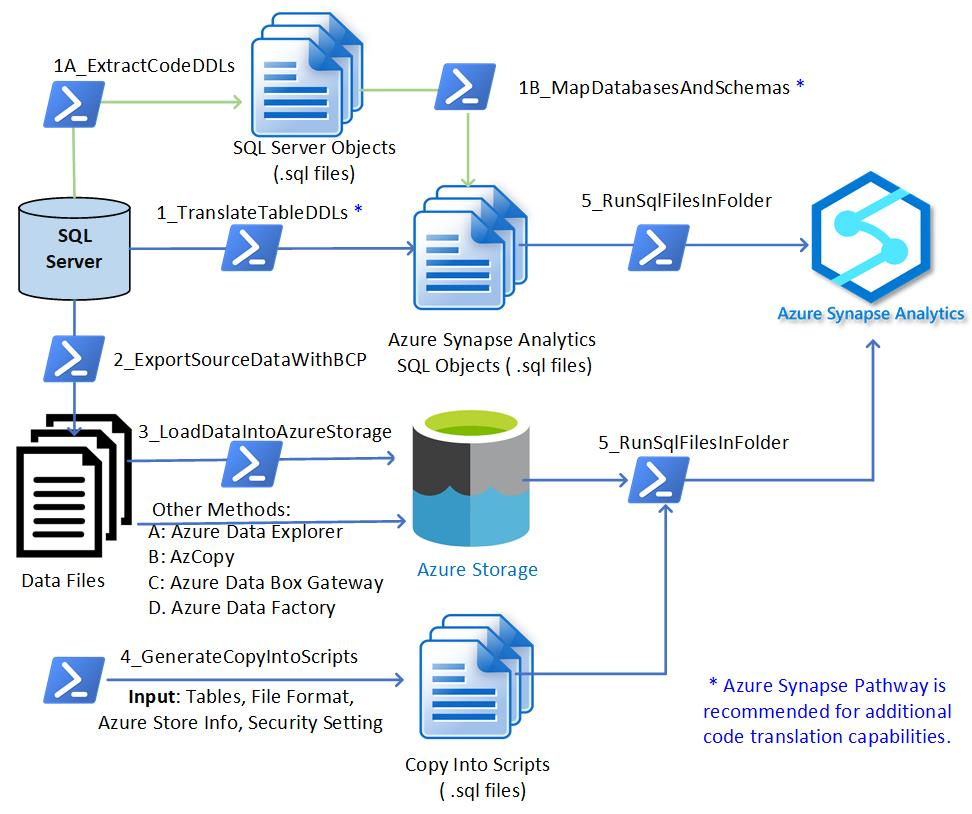
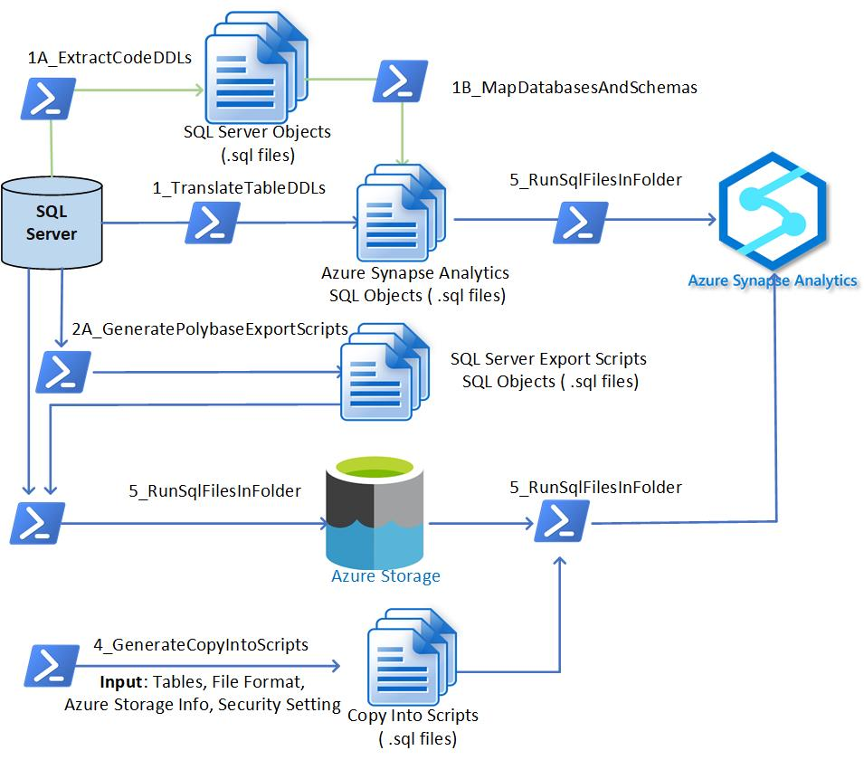

# **SQL Server to Azure Synapse Migration Process & Scripts** 

This directory contains SQL server to Azure Synapse Migration Toolkit. It includes the Process, PowerShell Scripts, and useful Utilities within each module.

Below two documents posted in this directory provide additional information besides what is already documented in reame.md files:

- [**SqlToSynapseMigrationOverview.pdf**](https://github.com/microsoft/AzureSynapseScriptsAndAccelerators/blob/main/Migration/SQLServer/SqlToSynapseMigrationOverview.pdf) - Overview of the SQL Server to Synapse Migration Modules for migrating tables and data. It provides step by step guide for exporting SQL Server data using BCP (Bulk Copy Program) or Polybase. It also provides guide for importing data into Azure Synapse.  Please note that Polybase is only available for SQL server 2016 or later versions.  
- [**SqlToSynapseMigration_User_Guide.pdf**](https://github.com/microsoft/AzureSynapseScriptsAndAccelerators/blob/main/Migration/SQLServer/SqlToSynapseMigration_User_Guide.pdf) - User Guide that provides additional information. This document does not include information on enhancement modules 1A and 1B. Please refer to the readme page of each module  for detailed guide .

In addition, within each module (subfolder in this directory), there is a README.md file to guide you through the usage and configuration files for the particular module. 

### **What does the Migration Utilities do?** 

The PowerShell Scripts performs below functions: 

1. Translate SQL Server Table DDLs into Azure Synapse DDLs, Extract Code DDLs (Views, Functions, Stored Procedures, and Triggers), Map Databases and Schemas.  **We recommend Azure Synapse Pathway (ASP) for this capability as ASP is the official Code Translation tool which continues to deliver comprehensive capabilities. **
2. **Execute Translated Table DDLs** in Azure Synapse
3. Export SQL Server Data Via BCP to local storage <u>(BCP Data Export Option, for all SQL Servers)</u>.
4. Generate Polybase Export T-SQL Scripts <u>(Polybase Data Export Option, for SQL Server 2016 or later)</u>.
5. **Execute Generated Polybase Export Scripts** <u>(Data exported to Azure Storage after this task)</u>.
6. Upload Exported Data into Azure Data Lake Store (or Blob Storage) if using BCP Export Option.
7. Generate T-SQL Copy Import Scripts. 
8. **Execute T-SQL Copy Import Scripts** to Import Data into Azure Synapse <u>(Data is imported into Azure Synapse Tables from Azure Storage after this step)</u>.

### **What are in the Migration Utilities?** 

There are eight modules that contain PowerShell Scripts designed to accomplish key tasks that are relevant to SQL server to Azure Synapse migration. For BCP export, you can use Modules 1, 1A, 1B, 2, 3, 4, and 5. For Polybase export, you can use Modules 1, 1A, 1B, 2A, 4, and 5. Module 5 is reused in multiple tasks as it is designed as an all-purpose T-SQL code execution utility. 

The modules are summarized as below:

**[1_TranslateTableDDLs](https://github.com/microsoft/AzureSynapseScriptsAndAccelerators/tree/main/Migration/SQLServer/1_TranslateTableDDLs)**: Translate SQL Table objects from SQL Server format to Azure Synapse format. The output is stored as Create Table .sql files in specified file folder.

**[1A_ExtractCodeDDLs](https://github.com/microsoft/AzureSynapseScriptsAndAccelerators/tree/main/Migration/SQLServer/1A_ExtractCodeDDLs)**: Script out SQL Objects (Views, Functions, Stored Procedures, and Triggers) and write each object into a seperate .sql file.  

**[1B_MapDatabasesAndSchemas](https://github.com/microsoft/AzureSynapseScriptsAndAccelerators/tree/main/Migration/SQLServer/1B_MapDatabasesAndSchemas)**: Map SQL Server Database & Schema into Synapse Database and Schema. In addition, unsupported data types in the code are mostly discovered and counted. 

[**2_ExportSourceDataWithBCP**](https://github.com/microsoft/AzureSynapseScriptsAndAccelerators/tree/main/Migration/SQLServer/2_ExportSourceDataWithBCP): Export SQL Server Tables into data files stored in delimited text format (.csv or .txt).  

**[2A_GeneratePolybaseExportScripts](https://github.com/microsoft/AzureSynapseScriptsAndAccelerators/tree/main/Migration/SQLServer/2A_GeneratePolybaseExportScripts)**:  Generate Polybase Export T-SQL Script for each table in the table list (configurable).  Polybase export set up examples are provided in subfolder “Utilities” inside this module. 

[**3_LoadDataIntoAzureStorage**](https://github.com/microsoft/AzureSynapseScriptsAndAccelerators/tree/main/Migration/SQLServer/3_LoadDataIntoAzureStorage): Load exported data files into specified container in Azure Storage (Blob Storage or Azure Data Lake Store).

[**4_GenerateCopyIntoScripts**](https://github.com/microsoft/AzureSynapseScriptsAndAccelerators/tree/main/Migration/SQLServer/4_GenerateCopyIntoScripts): Generate “COPY Into” T-SQL Scripts, once executed, will move data from Azure Storage into Azure Synapse SQL Pool tables.

[**5_RunSqlFilesInFolder**](https://github.com/microsoft/AzureSynapseScriptsAndAccelerators/tree/main/Migration/SQLServer/5_RunSqlFilesInFolder): Run all T-SQL Scripts defined in .sql files stored in a specified file folder. The T-SQL Scripts can be DDL, DML, Data Movement Scripts (such as Copy Into scripts or Polybase Export Scripts), or any other scripts such as create/update statistics or indexes. In fact, this module is designed to run any SQL scripts in a folder. 

### Migration Option 1: Use BCP to Export SQL Server Data (Works with All Versions of SQL Server) 

If using BCP option, you will need to use Modules 1, 1A, 1B, 2, 3, 4, and 5. The overall tasks and flows are illustrated in the figure below. 

### **Migration Option 2: Use Polybase to Export SQL Server Data - Works SQL Server** 2016 or Later Versions

If using Polybase option, you will need to use Modules 1, 2A,  4, and 5. Module 3 is not needed as the Polybase method will load data directly to Azure Storage from SQL Server. The overall tasks and flows are illustrated in the figure below.

### **Complementary to Azure Synapse Pathway and Can Run ASP Output Code ** 

These Scripts are complementary to Azure Synapse Pathway (ASP). ASP does not perform data migration today (as of June 2021). We designed and implemented 6 modules to complete the end-to-end tasks of tables migration and data migration (using BCP or Polybase Export). Please check the latest release of Azure Synapse Pathway for more advanced SQL Server code translation capabilities. 

<u>You can use scripts described in this document (Module 5_RunSqlFilesInFolder) to execute all translated code by ASP or other methods.</u> Please check the newest release of Azure Synapse Pathway so you can use the best available functions. [Release notes - Azure Synapse Pathway | Microsoft Docs](https://docs.microsoft.com/en-us/sql/tools/synapse-pathway/pathway-release-notes?view=azure-sqldw-latest)

### Reusability of  Module 3, 4, and 5 (for Netezza/Teradata/Exadata/etc. to Azure Synapse Migration)

Module 3, 4, 5 are reusable for other types of migrations, for example, Netezza or Teradata or Exadata or Oracle to Azure Synapse migrations. After the code is translated, and data is exported out of source systems, the rest of the tasks are the same. Therefore module 3-5 can be utilized for any of those migrations. 

